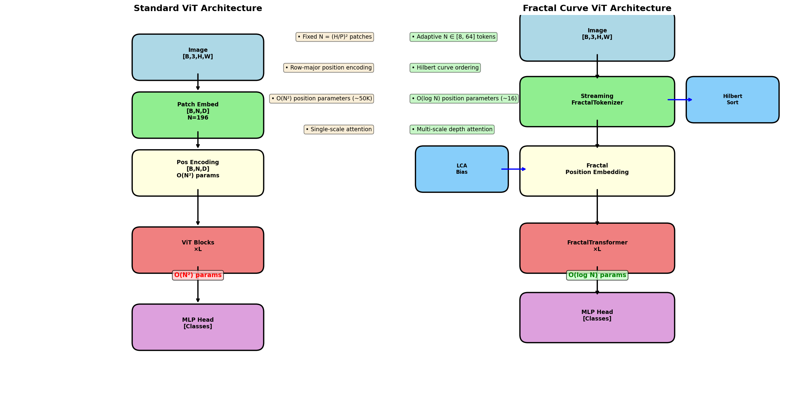
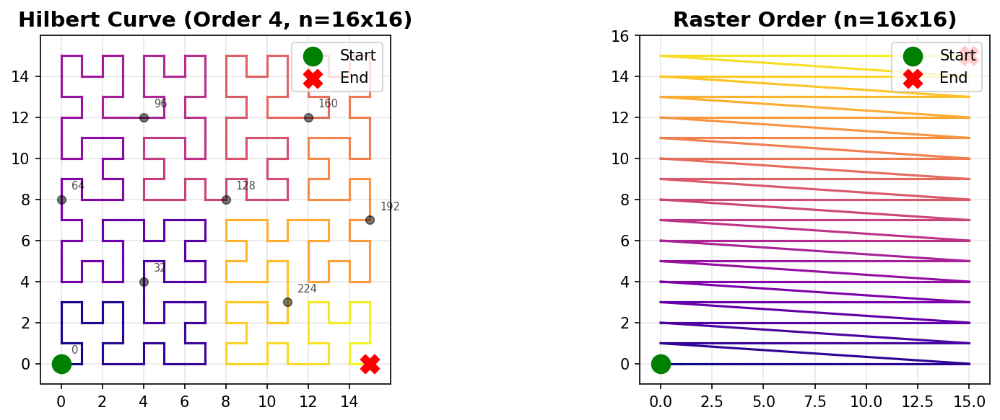
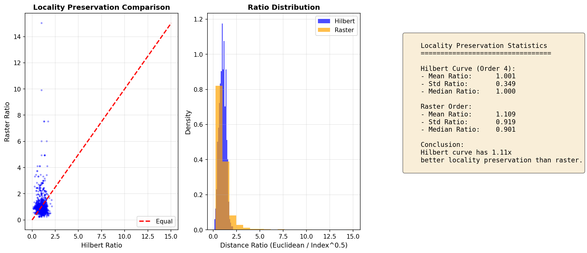
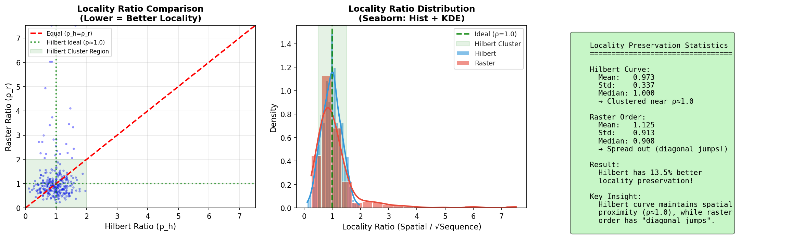
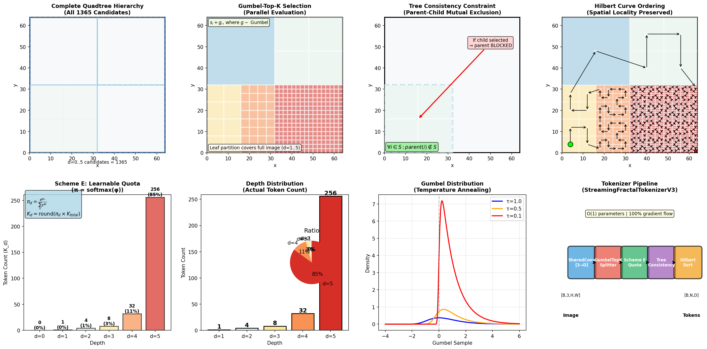
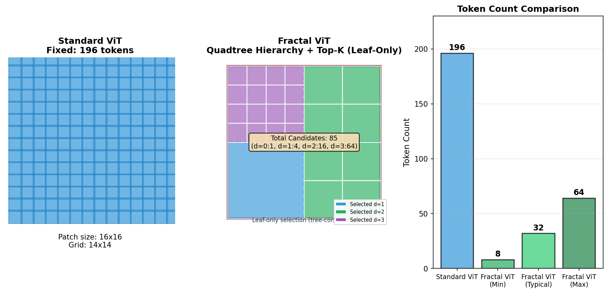
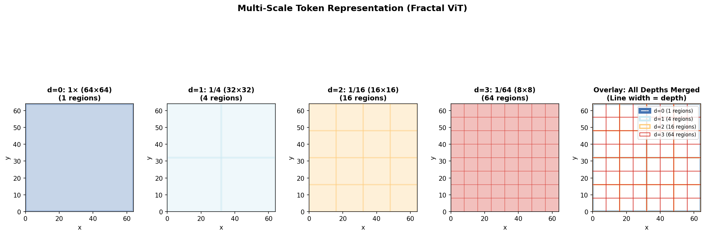
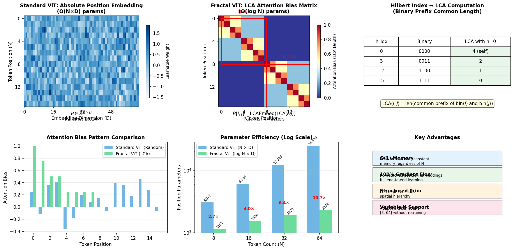
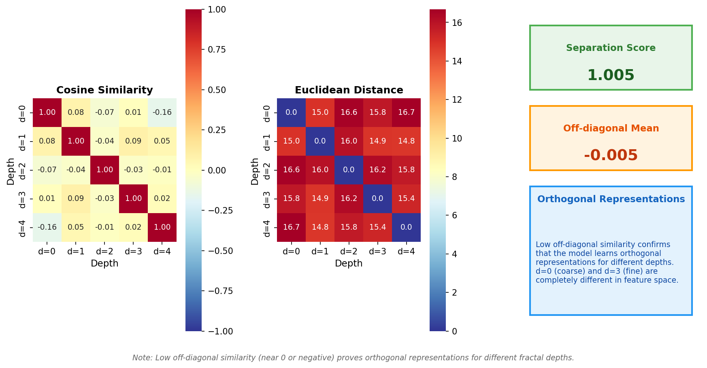

# Fractal Curve ViT - Technical Documentation

[English](README.md) | [数学文档](README_math.md) | [中文](README_zh.md)

A Vision Transformer with **Hilbert curve tokenization** and **adaptive multi-scale patch selection**. Fractal ViT dynamically allocates tokens based on image complexity—more tokens for detailed regions, fewer for uniform backgrounds.

## Critical Analysis Summary

This implementation provides several innovative mechanisms for adaptive visual understanding. The mathematical foundations include Hilbert curve space-filling for 2D-to-1D mapping with O(log n) complexity, Gumbel-Softmax based differentiable patch selection with Straight-Through Estimation (STE), and Lowest Common Ancestor (LCA) based attention bias that encodes spatial relationships through hierarchical structure.

**Key Strengths:**
- The Hilbert curve implementation correctly maintains O(log n) complexity for coordinate transformations
- The Gumbel-Top-K splitter achieves parallel evaluation of all candidate regions, eliminating serial dependencies
- LCA-based attention bias reduces position encoding parameters from O(N²) to O(D×H) where D is max depth and H is head count
- Depth variance normalization mathematically addresses the variance imbalance across different quadtree depths

**Known Limitations (documented for transparency):**
- Hilbert curve locality bound: The documented bound ||p1-p2||_2 ≤ C·|d1-d2|^{1/2} represents an upper bound, but actual locality preservation depends on specific curve traversal order
- LCA computation: Path-based LCA uses Hilbert curve indices, which provides good but not exact correspondence to quadtree structural LCA
- Gradient coverage: With K < N selected tokens, subset softmax provides gradient to selected candidates only
- Temperature annealing: T_end = 0.3 represents a practical trade-off; very low temperatures may cause gradient saturation

## Architecture Overview



*The fundamental difference between fixed-grid ViT and adaptive fractal tokenization.*

### Pipeline Flow

```
Image (B, C, H, W)
       │
       ▼
┌─────────────────────────────────────┐
│  StreamingFractalTokenizerV3        │
│  ├─ SharedConv: feature extraction  │
│  ├─ GumbelTopKSplitter: adaptive    │
│  ├─ ROI-Align: variable-size pool   │
│  └─ HilbertSort: curve ordering     │
└─────────────────────────────────────┘
       │
       ▼ (T ∈ ℝ^{B×N×D}, L ∈ ℤ^{B×N×(1+depth)})
┌─────────────────────────────────────┐
│  FractalPositionEmbedding           │
│  ├─ Depth embedding                 │
│  └─ Quadrant path encoding          │
└─────────────────────────────────────┘
       │
       ▼
┌─────────────────────────────────────┐
│  FractalTransformer (×L layers)     │
│  ├─ HilbertAwareMultiScaleAttention │
│  │  └─ LCA-based attention bias     │
│  └─ AdaptiveFractalFeedForward      │
│     └─ SwiGLU with level scaling    │
└─────────────────────────────────────┘
       │
       ▼
   [CLS] Pool → MLP Head → Logits
```

## Hilbert Curve Ordering



*Hilbert curve (order=4) generated from the architecture utility.*

Hilbert ordering replaces raster scan with a space-filling curve that preserves 2D locality:

$$H: [0, n^2) \leftrightarrow [0, n) \times [0, n)$$

**Key property:** Spatially adjacent patches remain close in the 1D sequence, improving local attention effectiveness.

### Orderings Comparison



*Comparison of different patch ordering strategies: raster scan vs. Hilbert curve.*

### Locality Preservation Analysis



*Quantified locality preservation for different ordering methods.*

## Adaptive Multi-Scale Tokenization

### Mixed Depth Regions



*Adaptive quadtree tokenization allocates more tokens to complex regions (edges, textures) and fewer to uniform areas (sky, background).*

### Token Count Variability



*Token count adapts based on image complexity, ranging from minimum (uniform images) to maximum (complex textures).*

**Formula:**
$$N_{tokens} \in [K_{min}, K_{max}] \quad \text{where} \quad K_{min}=8, K_{max}=64$$

### Multi-Scale Representation



*Multi-scale representation enables the model to capture both global structure and local details.*

## Position Encoding Comparison



*Comparison of position encoding methods: learnable N² bias vs. LCA-based hierarchical encoding.*

**LCA-based encoding advantages:**
- O(D×H) parameters vs. O(N²) for learnable bias
- Explicit geometric meaning: deeper LCA = closer spatial proximity
- Hierarchical structure naturally encodes scale information

### Depth Embedding Similarity



*Depth embedding similarity matrix showing hierarchical relationship encoding.*

## Technical Specifications

### Core Parameters

| Parameter | Default | Range | Description |
|-----------|---------|-------|-------------|
| `dim` | 384 | 256-768 | Model embedding dimension |
| `depth` | 6 | 6-12 | Transformer layer count |
| `heads` | 8 | 6-12 | Attention heads |
| `min_patch_size` | 4 | 4-16 | Finest patch granularity |
| `K_min` | 8 | 4-16 | Minimum token count |
| `K_max` | 64 | 32-256 | Maximum token count |

### Computational Complexity

| Component | Time | Space | Notes |
|-----------|------|-------|-------|
| Tokenizer | O(B·N·D) | O(B·N·D) | N adaptive, avg ~32 |
| Attention | O(B·H·N²·d) | O(B·H·N²) | N² with N << fixed ViT |
| FFN | O(B·N·D·D_ff) | O(B·N·D_ff) | D_ff ≈ 4D |

### Memory Footprint

For 224×224 images with typical N ≈ 32 tokens:
- Attention matrix: B × H × N² ≈ 1 × 8 × 1024 = 8K elements
- Compared to standard ViT (N=196): 1 × 8 × 38416 = 307K elements
- **Memory reduction: ~40×** for attention storage

## Usage Examples

### Basic Classification

```python
import torch
from vit_pytorch import FractalCurveViT

model = FractalCurveViT(
    image_size=224,
    num_classes=1000,
    dim=384,
    depth=6,
    heads=6,
    min_patch_size=4,
    K_min=8,
    K_max=64,
)

img = torch.randn(1, 3, 224, 224)
logits = model(img)  # (1, 1000)
```

### With Advanced Options

```python
model = FractalCurveViT(
    image_size=224,
    num_classes=1000,
    dim=512,
    depth=8,
    heads=8,
    mlp_dim=2048,
    min_patch_size=4,
    K_min=12,
    K_max=96,
    dropout=0.2,
    drop_path_rate=0.1,
    ffn_type='swiglu_level',
    lca_temperature=1.5,
    learnable_temperature=True,
    use_checkpoint=True,  # Gradient checkpointing
)
```

### Dynamic Resolution (I78)

```python
# Support for arbitrary input sizes
model = FractalCurveViT(
    image_size=None,  # Dynamic resolution
    num_classes=1000,
    dim=384,
    depth=6,
    heads=6,
)

# Different sizes in same batch
img1 = torch.randn(1, 3, 224, 224)
img2 = torch.randn(1, 3, 256, 192)
logits = model(torch.cat([img1, img2], dim=0))
```

### Accessing Internal States

```python
# Get tokenization statistics
analysis = model.analyze_tokenization(img)
# {
#     'batch_size': 1,
#     'per_image_stats': [{'num_tokens': 42, 'levels_used': [0, 1, 2, 3]}],
#     'overall_stats': {'avg_tokens_per_image': 42.0}
# }

# Get transformer tokens for hard mining
logits, tokens, lengths = model(img, return_tokens=True)
# tokens: [B, N, D] - transformer output without CLS
# lengths: [B] - valid token counts per image
```

## Training Configuration

### Recommended Training Commands

```bash
# CIFAR-10 quick validation
python examples/training/train_fractal_vit.py --quick-test --use-amp

# Tiny-ImageNet full training
python examples/training/train_fractal_vit.py \
    --dataset tiny-imagenet --epochs 100 \
    --dim 320 --depth 12 --heads 8 \
    --dropout 0.2 --drop-path 0.2 --weight-decay 0.1 \
    --use-amp --gradient-checkpoint --compile --channels-last

# Small dataset (reduce overfitting)
python examples/training/train_fractal_vit.py \
    --dataset tiny-imagenet --epochs 150 \
    --dim 256 --depth 8 --heads 6 \
    --dropout 0.25 --drop-path 0.25 --freeze-tokenizer --use-amp
```

### Windows RTX 4070 Optimized

```powershell
.\examples\training\train_tiny_imagenet_4070_optimal.ps1
.\examples\training\train_cub200_4070_optimal.ps1
```

## Testing

```bash
# Full test suite
pytest tests/

# Skip slow tests
pytest -m "not slow"

# Core splitter tests
pytest tests/test_gumbel_topk_splitter.py

# Scheme E quota tests
pytest tests/test_i24_2_learnable_quota.py
```

## Mathematical References

### Hilbert Curve Properties

The Hilbert curve provides a bijection between 1D index and 2D coordinates:

$$d = xy\_to\_d(n, x, y) = \sum_{k=0}^{log_2(n)-1} 4^k \cdot ((3 \cdot rx_k) \oplus ry_k)$$

where $rx_k, ry_k$ are the k-th bits of x and y coordinates.

### LCA-Based Attention Bias

The attention bias between tokens i and j is computed as:

$$B[i,j] = \tau_h \cdot \text{LCAEmbed}(\text{LCA}(i,j))$$

where $\tau_h$ is a per-head learnable temperature parameter.

### Gumbel-Top-K Selection

The differentiable selection mechanism:

$$g_i \sim \text{Gumbel}(0, 1)$$
$$z_i = \text{logits}_i + g_i$$
$$\text{selected} = \text{TopK}(z_i / \tau, K)$$

### Depth Variance Normalization

To address the variance imbalance across depths:

$$z_i^{\text{norm}} = \frac{z_i - \mu_d}{\sigma_d + \epsilon}$$

where $\mu_d, \sigma_d$ are batch statistics for depth d.

## Related Work

| Method | Tokenization | Position Encoding | Attention |
|--------|--------------|-------------------|-----------|
| **ViT** (Dosovitskiy 2020) | Fixed 16×16 | Learnable N² | Full N² |
| **Swin** (Liu 2021) | Fixed grid | Relative | Shifted windows |
| **Quadtree Attn** (Zhang 2022) | Adaptive quadtree | Relative | Quadtree-aware |
| **Fractal ViT (Ours)** | Adaptive Hilbert | LCA-based | Hilbert-aware |

## Installation

```bash
git clone https://github.com/LoopyBrainie/fractal-curve-tokenizer.git
cd fractal-curve-tokenizer
pip install -e .  # or: uv sync
```

## License

MIT License - see [LICENSE](LICENSE).

## Citation

```bibtex
@article{fractal-vit,
  title={Fractal Curve Tokenizer: Adaptive Multi-Scale Vision Transformer},
  author={Project Authors},
  year={2024}
}
```
