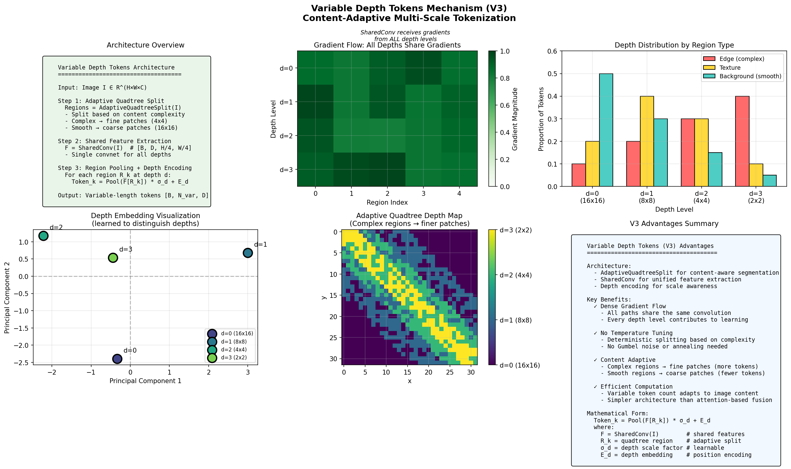

# Fractal Curve Tokenizer

[English](README.md) | [中文](README_zh.md)

A Vision Transformer (ViT) with **Hilbert curve tokenization** and **adaptive multi-scale patch selection**.

## Quick Start

```python
import torch
from vit_pytorch import FractalCurveViT

model = FractalCurveViT(
    image_size=224,
    num_classes=1000,
    dim=384,
    depth=6,
    heads=6,
)

img = torch.randn(1, 3, 224, 224)
logits = model(img)  # (1, 1000)
```

## Architecture

```
Image (B, C, H, W)
       │
       ▼
┌──────────────────────────────┐
│  StreamingFractalTokenizerV3 │  Multi-scale Conv + Cross-Scale Attention
│  └─ Hilbert Reordering       │
└──────────────────────────────┘
       │
       ▼
┌──────────────────────────────┐
│  FractalPositionEmbedding     │  Depth + Path Embedding
│                               │
└──────────────────────────────┘
       │
       ▼
┌──────────────────────────────┐
│  FractalTransformer           │
│  ├─ HilbertAwareAttention    │  LCA Bias (recommended)
│  └─ SwiGLU FFN               │
└──────────────────────────────┘
       │
       ▼
   MLP Head → Logits
```

## Data Flow

$$I \xrightarrow{\text{Tokenizer}} (T, L) \xrightarrow{E_{\text{pos}}} T' \xrightarrow{\text{Transformer}} z \xrightarrow{\text{MLP}} \hat{y}$$

| Symbol    | Shape                | Description                       |
| --------- | -------------------- | --------------------------------- |
| $I$       | `(B, C, H, W)`       | Input image                       |
| $T$       | `(B, N, D)`          | Token embeddings                  |
| $L$       | `(B, N, depth+path)` | Level info: depth + quadrant path |
| $\hat{y}$ | `(B, classes)`       | Output logits                     |

## Visualizations

### Hilbert Curve Basics

<table>
<tr>
<td width="50%">

**Curve Orders (1-5)**


</td>
<td width="50%">

**Curve Growth Animation**


</td>
</tr>
</table>

### Locality Preservation

Hilbert curves map 2D grids to 1D sequences while **preserving spatial locality**.


### Hierarchical Structure

<table>
<tr>
<td width="50%">

**Quadtree Decomposition**


</td>
<td width="50%">

**2D → 1D Mapping**


</td>
</tr>
</table>

### Multi-Scale Tokenization

<table>
<tr>
<td width="50%">

**Scale Hierarchy**


</td>
<td width="50%">

**Adaptive Segmentation**


</td>
</tr>
</table>

### Advanced Components

<table>
<tr>
<td width="50%">

**Cross-Scale Attention (V3)**



Dense gradient flow to all scales via softmax attention fusion.

</td>
<td width="50%">

**LCA Attention Bias**


LCA (Lowest Common Ancestor) depth encodes hierarchical distance.

</td>
</tr>
<tr>
<td colspan="2">

**Attention Bias Comparison**


LCA bias is most parameter-efficient with explicit geometric meaning.

</td>
</tr>
</table>

## Module Reference

| Layer  | Module                   | Key Class                              |
| ------ | ------------------------ | -------------------------------------- |
| **L4** | `fractal_vit.py`         | `FractalCurveViT`                      |
| **L3** | `streaming_tokenizer.py` | `StreamingFractalTokenizerV3` (recommended) |
|        | `transformer.py`         | `FractalTransformer`                   |
| **L2** | `attention.py`           | `LCAHilbertBias`, `HilbertAwareMultiScaleAttention`|
|        | `feedforward.py`         | `SwiGLUFFN`                            |
|        | `positional.py`          | `FractalPositionEmbedding`             |
| **L1** | `hilbert.py`             | `HilbertCurve`, `PseudoHilbertCurve`   |

## Configuration Options

### Tokenizer

| Type           | Description                                    |
| -------------- | ---------------------------------------------- |
| `streaming_v3` | **Recommended.** Cross-Scale Attention fusion  |
| `streaming_v2` | ⚠️ Deprecated. Gumbel-Softmax adaptive scale   |
| `streaming`    | Fixed multi-scale convolution                  |

### Attention Bias

| Mode           | Params | Description                          |
| -------------- | ------ | ------------------------------------ |
| `lca`          | ~100   | **Recommended.** LCA embedding table |
| `low_rank`     | ~50K   | Low-rank decomposition               |
| `hierarchical` | ~5K    | Per-level bias                       |
| `original`     | ~N²    | Full bias matrix                     |

### FFN Type

| Type           | Description                            |
| -------------- | -------------------------------------- |
| `swiglu_level` | **Default.** SwiGLU + level adaptation |
| `swiglu`       | SwiGLU only                            |
| `gelu`         | Standard GELU FFN                      |

## Installation

```bash
git clone https://github.com/LoopyBrainie/fractal-curve-tokenizer.git
cd fractal-curve-tokenizer
uv sync  # or: pip install -e .
```

## Training

```bash
# CIFAR-10 with default settings
uv run python examples/training/train_fractal_vit.py \
    --dataset cifar10 \
    --epochs 50

# Quick test
uv run python examples/training/train_fractal_vit.py --quick-test
```

### Key Arguments

| Argument           | Default        | Options                                              |
| ------------------ | -------------- | ---------------------------------------------------- |
| `--tokenizer-type` | `streaming_v3` | `streaming_v3`, `streaming_v2` (deprecated), `streaming` |
| `--bias-mode`      | `lca`          | `lca`, `low_rank`, `hierarchical`                    |
| `--ffn-type`       | `swiglu_level` | `swiglu_level`, `swiglu`, `gelu`                     |
| `--dataset`        | `cifar10`      | `cifar10`, `cifar100`, `mnist`, `tiny-imagenet`      |

## Evaluation & Visualization

```bash
# Evaluate trained model
uv run python examples/training/evaluate_and_visualize.py \
    --checkpoint experiments/.../checkpoints/best.pth

# Generate all visualizations
uv run python examples/training/visualize_fractal_curves.py --all
```

## Testing

```bash
uv run pytest              # All tests
uv run pytest tests/unit   # Unit tests only
```

## Project Structure

```
src/vit_pytorch/
├── fractal_vit.py          # Main model
├── streaming_tokenizer.py  # Tokenizer V1/V2
├── transformer.py          # Transformer blocks
├── attention.py            # Hilbert-aware attention
├── feedforward.py          # SwiGLU FFN
├── positional.py           # Position embedding
├── hilbert.py              # Hilbert curve algorithms
└── tokenization.py         # Base classes

examples/training/
├── train_fractal_vit.py           # Training script
├── evaluate_and_visualize.py      # Evaluation
└── visualize_fractal_curves.py    # Visualization
```

## Documentation

| Document | Description |
| -------- | ----------- |
| [Architecture Overview](documents/00_introduction.md) | Core concepts and design |
| [Hilbert Curve](documents/01_hilbert_curve.md) | Hilbert curve theory |
| [Fractal Tokenizer](documents/03_fractal_tokenizer.md) | Tokenizer implementation |
| [Training System](documents/09_training_system.md) | Training guide |
| [Testing & QA](documents/10_testing_qa.md) | Testing documentation |
| [Improvement History](documents/11_issues_roadmap.md) | Development changelog |
| [Improvement Plan](IMPROVEMENT_PLAN.md) | Future roadmap |

## License

MIT License - see [LICENSE](LICENSE).
