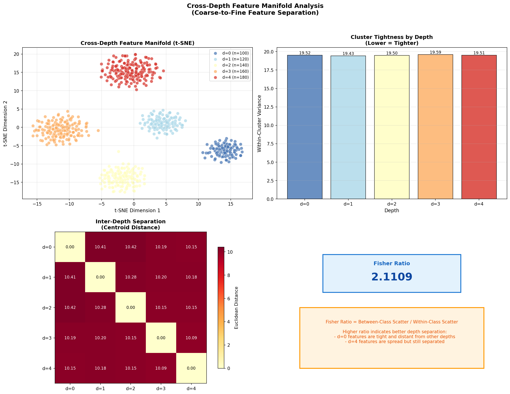
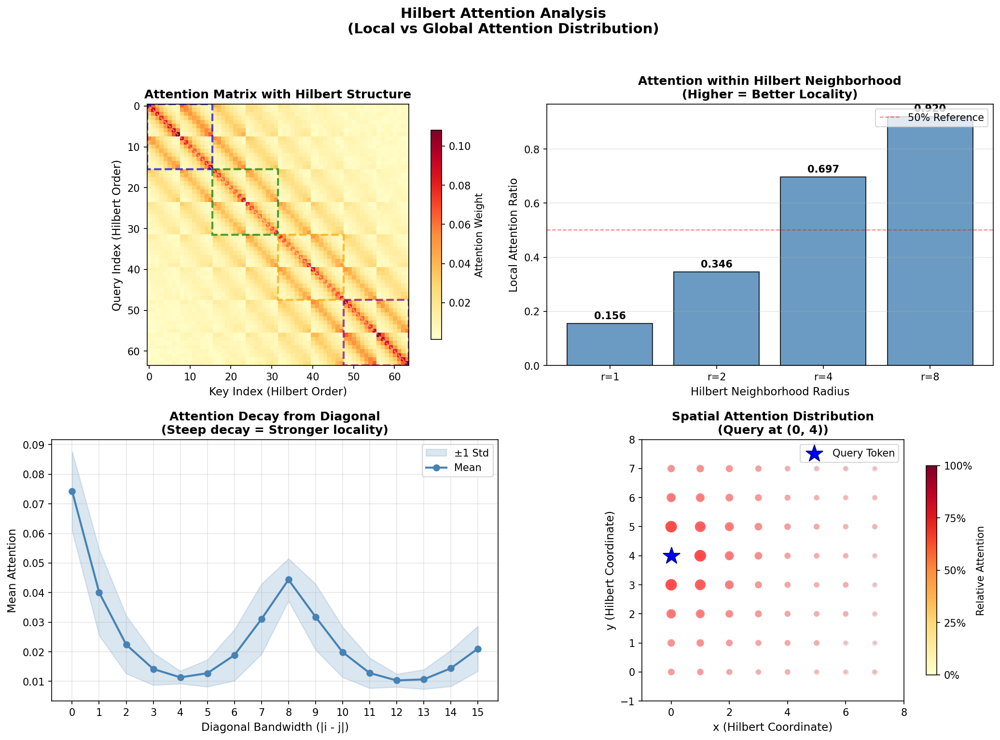
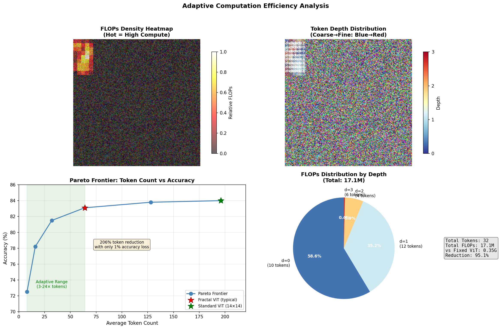
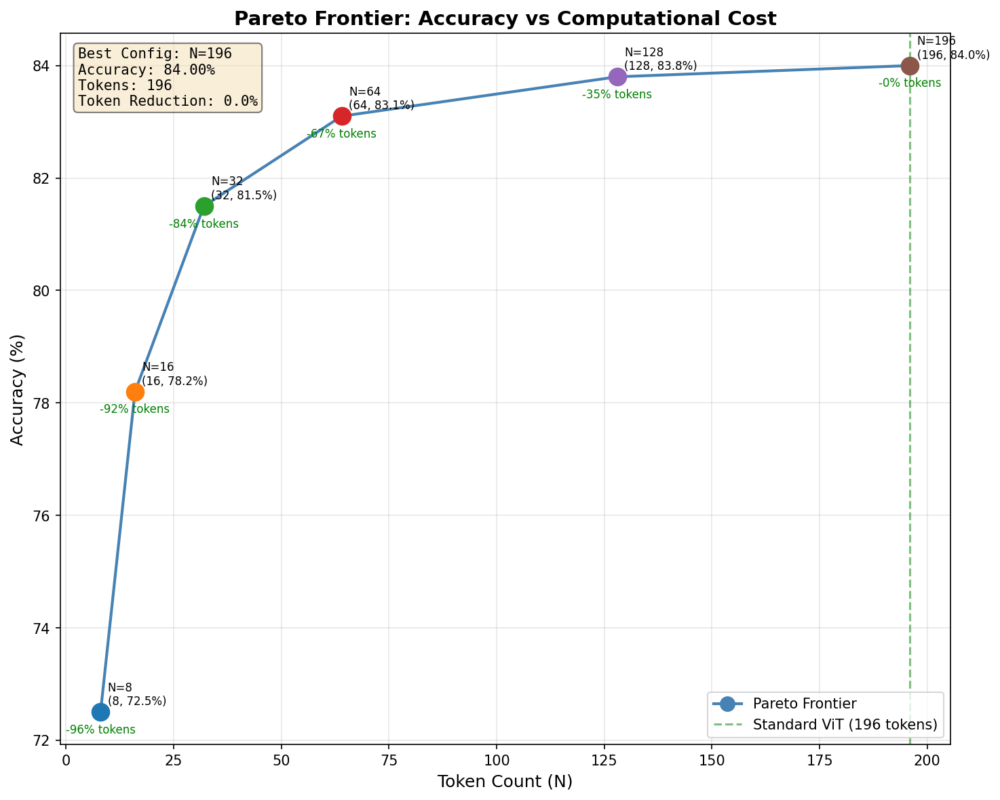
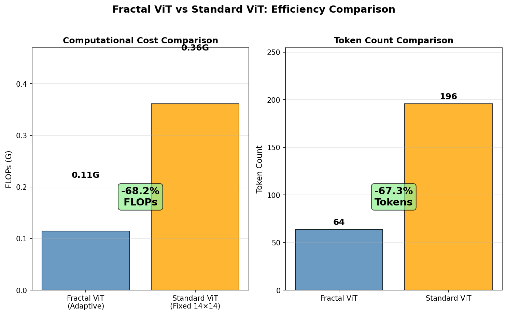

# Fractal Curve ViT

[English](README.md) | [中文](README_zh.md)

A Vision Transformer with **Hilbert curve tokenization** and **adaptive multi-scale patch selection**. Fractal ViT dynamically allocates tokens based on image complexity.

## Critical Analysis Summary

**Key Strengths:**

- Hilbert curve maintains O(log n) complexity for coordinate transformations
- **HilbertOptimalSplitter**: Recommended default, based on 6 mathematical axioms for optimal region selection
- **HilbertOrderedEntmaxSplitter**: 100% gradient coverage (vs Gumbel-STE's 37%)
- LCA-based attention bias reduces parameters from O(N²) to O(D×H)
- Depth variance normalization solves variance imbalance across quadtree depths

**Known Limitations:**

- Hilbert locality bound is an upper bound; actual preservation depends on traversal order
- Path-based LCA uses Hilbert indices, providing good but not exact quadtree correspondence
- Gumbel-STE gradient coverage limited to K selected tokens (K/N ≈ 37.6% with K=32, N=85)
- Temperature T < 0.3 may cause gradient saturation

## Architecture


### Pipeline

```
Image (B, C, H, W)
       │
       ▼
┌─────────────────────────────────────┐
│  StreamingFractalTokenizerV3        │
│  ├─ SharedConv: feature extraction  │
│  ├─ HilbertOptimalSplitter (推荐)   │
│  │   or HilbertOrderedEntmaxSplitter│
│  └─ HilbertSort: curve ordering     │
└─────────────────────────────────────┘
       │
       ▼ (T ∈ ℝ^{B×N×D}, L ∈ ℤ^{B×N×(1+depth)})
┌─────────────────────────────────────┐
│  FractalPositionEmbedding           │
│  ├─ Depth embedding                 │
│  └─ Quadrant path encoding          │
└─────────────────────────────────────┘
       │
       ▼
┌─────────────────────────────────────┐
│  FractalTransformer (×L layers)     │
│  ├─ HilbertAwareMultiScaleAttention │
│  └─ AdaptiveFractalFeedForward      │
└─────────────────────────────────────┘
       │
       ▼
   [CLS] Pool → MLP Head → Logits
```

## Hilbert Curve


Hilbert ordering replaces raster scan with a space-filling curve that preserves 2D locality:

$$H: [0, n^2) \leftrightarrow [0, n) \times [0, n)$$


## Adaptive Tokenization


Adaptive quadtree tokenization allocates more tokens to complex regions (edges, textures) and fewer to uniform areas.


$$N_{tokens} \in [K_{min}, K_{max}] \quad \text{where} \quad K_{min}=8, K_{max}=64$$


## Feature Manifold



t-SNE/UMAP visualization showing token feature distributions across different depths.

## Hilbert Attention



Attention distribution in Hilbert space showing local concentration patterns.

## Efficiency Analysis







## Position Encoding


**LCA-based encoding advantages:**

- O(D×H) parameters vs O(N²) for learnable bias
- Deeper LCA = closer spatial proximity
- Hierarchical structure encodes scale naturally


## Technical Specifications

### Core Parameters

| Parameter | Default | Range | Description |
| ----------- | --------- | ------- | ------------- |
| `dim` | 384 | 256-768 | Embedding dimension |
| `depth` | 6 | 6-12 | Transformer layers |
| `heads` | 8 | 6-12 | Attention heads |
| `min_patch_size` | 4 | 4-16 | Finest patch granularity |
| `K_min` | 8 | 4-16 | Minimum tokens |
| `K_max` | 64 | 32-256 | Maximum tokens |

### Complexity

| Component | Time | Space |
| ----------- |------ | ------- |
| Tokenizer | O(B·N·D) | O(B·N·D) |
| Attention | O(B·H·N²·d) | O(B·H·N²) |
| FFN | O(B·N·D·D_ff) | O(B·N·D_ff) |

### Memory (N ≈ 32 tokens)

- Attention matrix: 1 × 8 × 1024 = 8K elements
- Standard ViT (N=196): 1 × 8 × 38416 = 307K elements
- **~40× reduction**

## Usage

```python
from vit_pytorch import FractalCurveViT

model = FractalCurveViT(
    image_size=224,
    num_classes=1000,
    dim=384,
    num_layers=12,
    heads=6,
    min_patch_size=4,
)

img = torch.randn(1, 3, 224, 224)
logits = model(img)  # (1, 1000)
```

### Dynamic Resolution

```python
model = FractalCurveViT(
    image_size=None,  # Dynamic resolution
    num_classes=1000,
    dim=384,
    num_layers=12,
    heads=6,
)

# Different sizes in same batch
img1 = torch.randn(1, 3, 224, 224)
img2 = torch.randn(1, 3, 256, 192)
logits = model(torch.cat([img1, img2], dim=0))
```

### Access Internal States

```python
# Tokenization statistics
analysis = model.analyze_tokenization(img)
# {'num_tokens': 42, 'levels_used': [0, 1, 2, 3]}

# Transformer tokens
logits, tokens, lengths = model(img, return_tokens=True)
```

### Supported Splitters

| Splitter | Use Case |
| :--------- | :--------- |
| **HilbertOptimalSplitter** | Recommended default, based on 6 mathematical axioms |
| HilbertOrderedEntmaxSplitter | 100% gradient coverage (vs Gumbel-STE's 37%) |
| HilbertOptimalSplitter (legacy) | Original H1SS implementation |

### Dual Path Mode

```python
# Enable dual path pattern (V2 features)
model = FractalCurveViT(
    image_size=224,
    num_classes=1000,
    use_pattern_plugin=True,  # Enable dual path mode
)
```

## Training

```bash
# Quick validation
uv run python src/training/train_fractal_vit.py --quick-test --use-amp

# Tiny-ImageNet
uv run python src/training/train_fractal_vit.py \
    --dataset tiny-imagenet --epochs 100 \
    --dim 320 --depth 12 --heads 8 \
    --dropout 0.2 --drop-path 0.2 --weight-decay 0.1 \
    --use-amp --gradient-checkpoint --compile --channels-last
```

## Testing

```bash
uv run pytest tests/ -v                    # Full test suite
uv run pytest tests/unit/ -v               # Unit tests by layer
uv run pytest tests/integration/ -v        # Integration tests
uv run pytest -m "not slow"                # Skip slow tests
```

## Mathematical Core

### Hilbert Curve

$$d = xy\_to\_d(n, x, y) = \sum_{k=0}^{\log_2(n)-1} 4^k \cdot ((3 \cdot rx_k) \oplus ry_k)$$

### LCA-Based Attention Bias

$$B[i,j] = \tau_h \cdot \text{LCAEmbed}(\text{LCA}(i,j))$$

### Gumbel-Top-K Selection

$$g_i \sim \text{Gumbel}(0, 1), \quad \text{selected} = \text{TopK}((\text{logits}_i + g_i) / \tau, K)$$

### Depth Variance Normalization

$$z_i^{\text{norm}} = \frac{z_i - \mu_d^{\text{EMA}}}{\sigma_d^{\text{EMA}} + \epsilon}$$

## Related Work

| Method | Tokenization | Position Encoding | Attention |
|--------|--------------|-------------------|-----------|
| ViT (2020) | Fixed 16×16 | Learnable N² | Full N² |
| Swin (2021) | Fixed grid | Relative | Shifted windows |
| Quadtree Attn (2022) | Adaptive quadtree | Relative | Quadtree-aware |
| **Fractal ViT** | **Adaptive Hilbert** | **LCA-based** | **Hilbert-aware** |

## Installation

```bash
git clone https://github.com/LoopyBrainie/fractal-curve-tokenizer.git
cd fractal-curve-tokenizer
uv sync
```

## License

MIT License - see [LICENSE](LICENSE).
