# Fractal Curve Tokenizer (分形曲线分词器)

[English](README.md) | [中文](README_zh.md)

基于 **Hilbert 曲线分词** 和 **自适应多尺度 patch 选择** 的 Vision Transformer。

## 快速开始

```python
import torch
from vit_pytorch import NextGenerationFractalViT

model = NextGenerationFractalViT(
    image_size=224,
    num_classes=1000,
    dim=384,
    depth=6,
    heads=6,
)

img = torch.randn(1, 3, 224, 224)
logits = model(img)  # (1, 1000)
```

## 架构

```
图像 (B, C, H, W)
       │
       ▼
┌──────────────────────────────┐
│  StreamingFractalTokenizerV2 │  多尺度卷积 + Gumbel-Softmax
│  └─ Hilbert 重排序           │
└──────────────────────────────┘
       │
       ▼
┌──────────────────────────────┐
│  AdvancedFractalPosition     │  深度 + 路径编码
│  Embedding                   │
└──────────────────────────────┘
       │
       ▼
┌──────────────────────────────┐
│  EnhancedFractalTransformer  │
│  ├─ HilbertAwareAttention    │  LCA 偏置 (推荐)
│  └─ SwiGLU FFN               │
└──────────────────────────────┘
       │
       ▼
   MLP Head → Logits
```

## 数据流

$$I \xrightarrow{\text{Tokenizer}} (T, L) \xrightarrow{E_{\text{pos}}} T' \xrightarrow{\text{Transformer}} z \xrightarrow{\text{MLP}} \hat{y}$$

| 符号        | 形状                   | 说明             |
| --------- | -------------------- | -------------- |
| $I$       | `(B, C, H, W)`       | 输入图像           |
| $T$       | `(B, N, D)`          | Token 嵌入       |
| $L$       | `(B, N, depth+path)` | 层级信息：深度 + 象限路径 |
| $\hat{y}$ | `(B, classes)`       | 输出 logits      |

## 可视化

### Hilbert 曲线基础

<table>
<tr>
<td width="50%">

**曲线阶数 (1-5)**

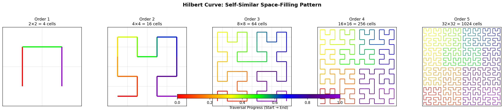

</td>
<td width="50%">

**曲线生长动画**

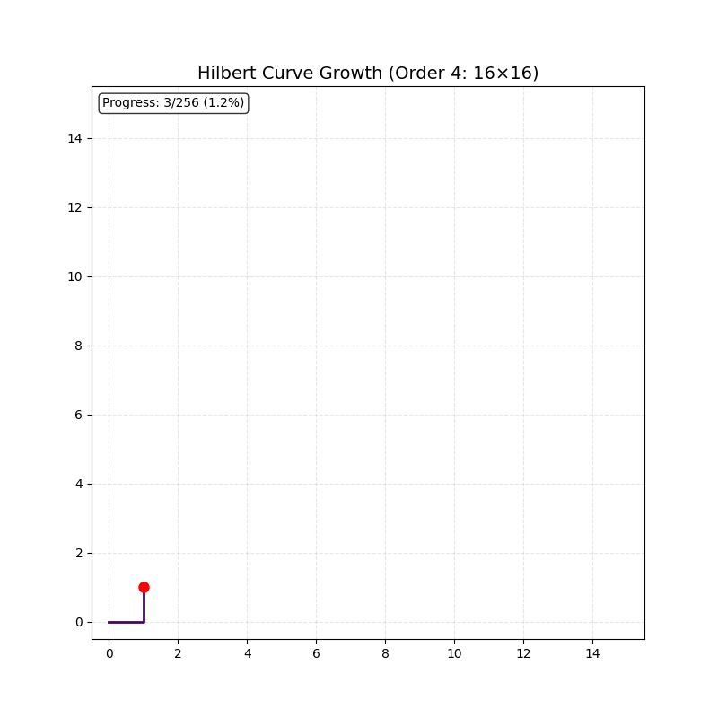

</td>
</tr>
</table>

### 局部性保持

Hilbert 曲线将 2D 网格映射到 1D 序列，同时**保持空间局部性**。

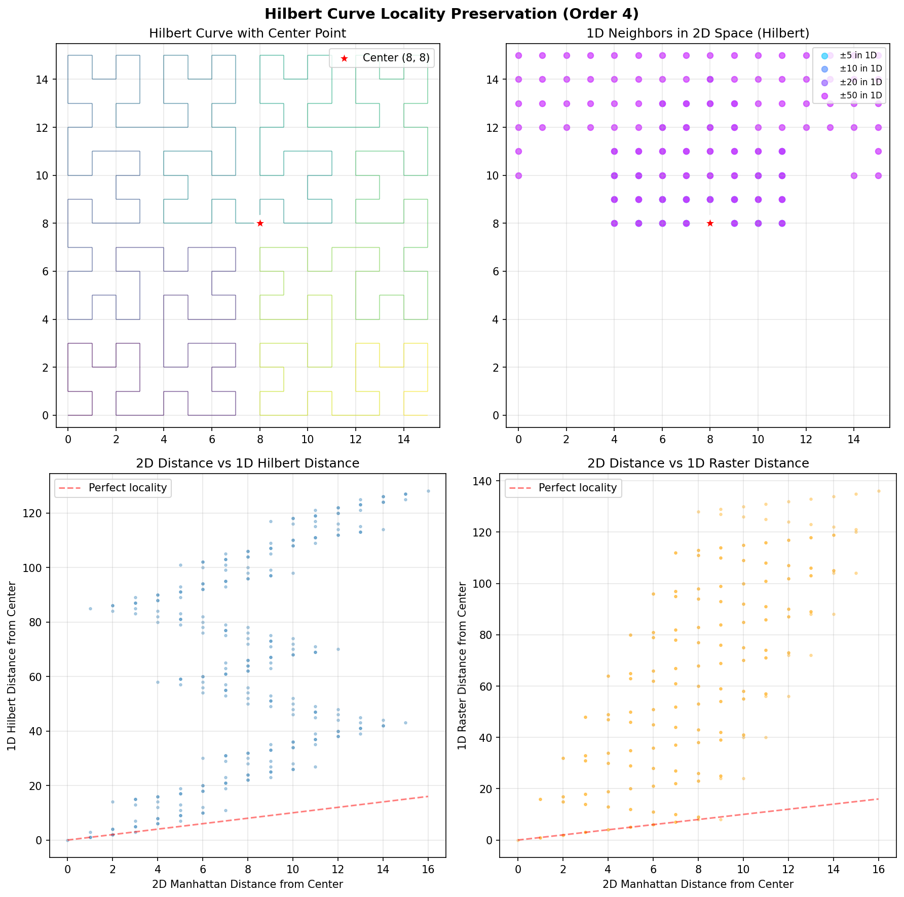

### 层级结构

<table>
<tr>
<td width="50%">

**四叉树分解**

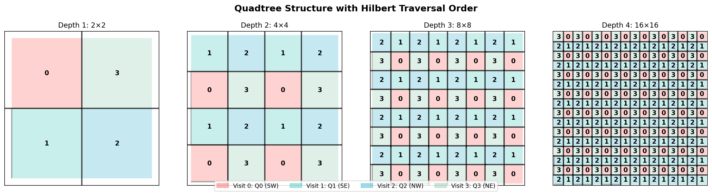

</td>
<td width="50%">

**2D → 1D 映射**

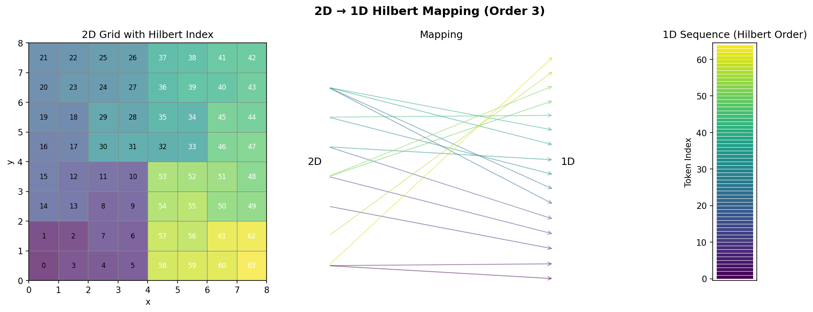

</td>
</tr>
</table>

### 多尺度分词

<table>
<tr>
<td width="50%">

**尺度层级**

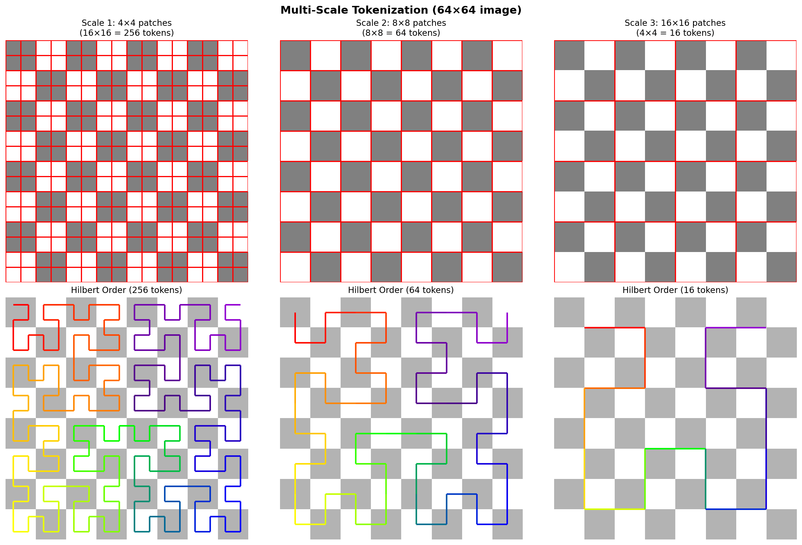

</td>
<td width="50%">

**自适应分割**

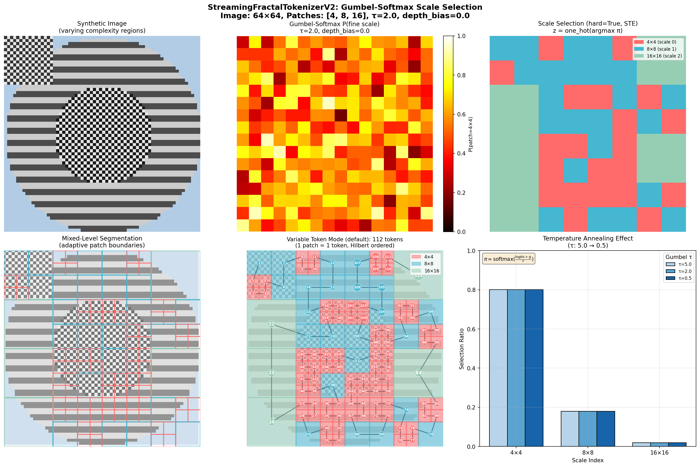

</td>
</tr>
</table>

### 高级组件

<table>
<tr>
<td width="50%">

**LCA 注意力偏置**

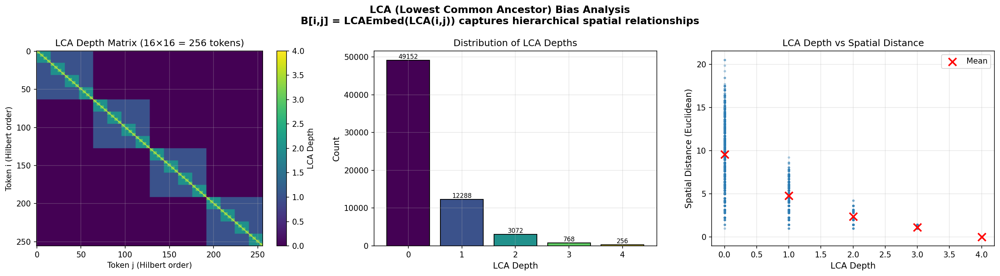

LCA（最低公共祖先）深度编码层级距离。

</td>
<td width="50%">

**Gumbel-Softmax 尺度选择**

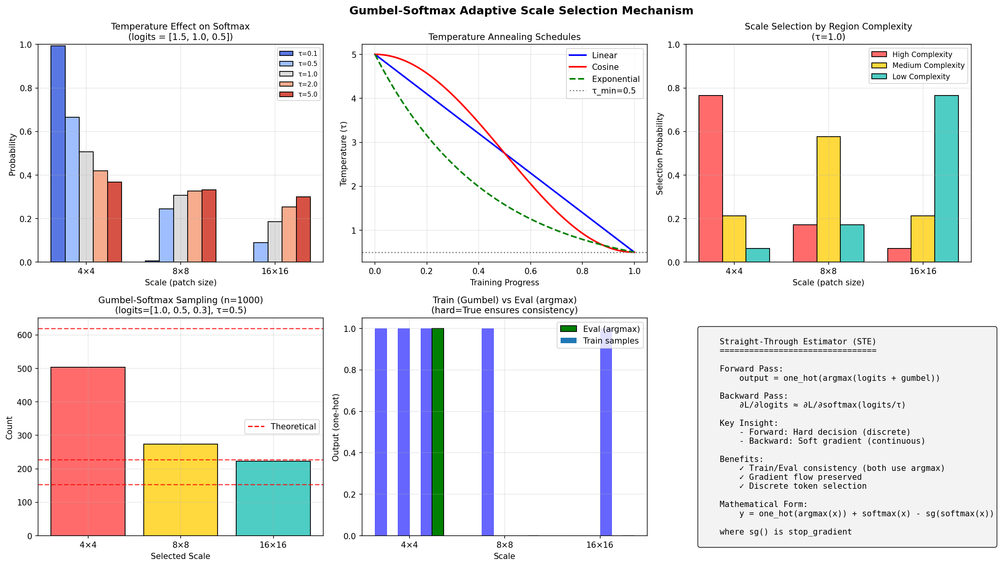

可微分的离散尺度选择，支持温度退火。

</td>
</tr>
<tr>
<td width="50%">

**深度偏置预热**

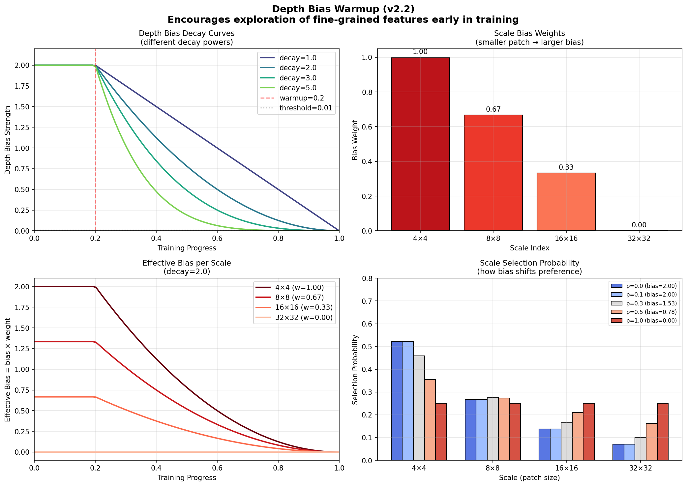

渐进式衰减，在训练初期鼓励细粒度探索。

</td>
<td width="50%">

**注意力偏置对比**

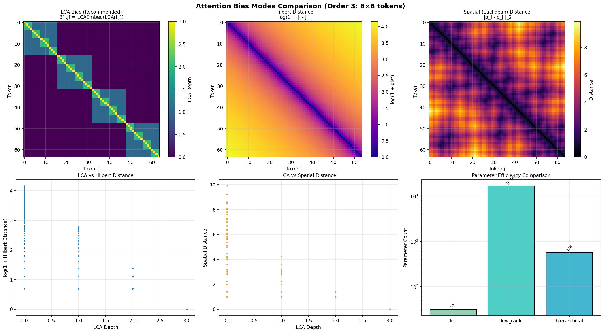

LCA 偏置参数最少，且具有明确的几何意义。

</td>
</tr>
</table>

## 模块参考

| 层级     | 模块                       | 核心类                                    |
| ------ | ------------------------ | -------------------------------------- |
| **L4** | `fractal_vit.py`         | `NextGenerationFractalViT`             |
| **L3** | `streaming_tokenizer.py` | `StreamingFractalTokenizerV2`          |
|        | `transformer.py`         | `EnhancedFractalTransformer`           |
| **L2** | `attention.py`           | `LCAHilbertBias`, `LowRankHilbertBias` |
|        | `feedforward.py`         | `SwiGLUFFN`                            |
|        | `positional.py`          | `AdvancedFractalPositionEmbedding`     |
| **L1** | `hilbert.py`             | `HilbertCurve`, `PseudoHilbertCurve`   |

## 配置选项

### Tokenizer

| 类型             | 说明                          |
| -------------- | --------------------------- |
| `streaming_v2` | **推荐** Gumbel-Softmax 自适应尺度 |
| `streaming`    | 固定多尺度卷积                     |

### 注意力偏置

| 模式             | 参数量  | 说明             |
| -------------- | ---- | -------------- |
| `lca`          | ~100 | **推荐** LCA 嵌入表 |
| `low_rank`     | ~50K | 低秩分解           |
| `hierarchical` | ~5K  | 逐层偏置           |
| `original`     | ~N²  | 完整偏置矩阵         |

### FFN 类型

| 类型             | 说明                    |
| -------------- | --------------------- |
| `swiglu_level` | **默认** SwiGLU + 层级自适应 |
| `swiglu`       | 仅 SwiGLU              |
| `gelu`         | 标准 GELU FFN           |

## 安装

```bash
git clone https://github.com/LoopyBrainie/fractal-curve-tokenizer.git
cd fractal-curve-tokenizer
uv sync  # 或: pip install -e .
```

## 训练

```bash
# CIFAR-10 使用默认设置
uv run python examples/training/train_fractal_vit.py \
    --dataset cifar10 \
    --epochs 50

# 快速测试
uv run python examples/training/train_fractal_vit.py --quick-test
```

### 关键参数

| 参数                 | 默认值            | 选项                                              |
| ------------------ | -------------- | ----------------------------------------------- |
| `--tokenizer-type` | `streaming_v2` | `streaming_v2`, `streaming`                     |
| `--bias-mode`      | `lca`          | `lca`, `low_rank`, `hierarchical`               |
| `--ffn-type`       | `swiglu_level` | `swiglu_level`, `swiglu`, `gelu`                |
| `--dataset`        | `cifar10`      | `cifar10`, `cifar100`, `mnist`, `tiny-imagenet` |

## 评估与可视化

```bash
# 评估训练好的模型
uv run python examples/training/evaluate_and_visualize.py \
    --checkpoint experiments/.../checkpoints/best.pth

# 生成所有可视化
uv run python examples/training/visualize_fractal_curves.py --all
```

## 测试

```bash
uv run pytest              # 所有测试
uv run pytest tests/unit   # 仅单元测试
```

## 项目结构

```
src/vit_pytorch/
├── fractal_vit.py          # 主模型
├── streaming_tokenizer.py  # Tokenizer V1/V2
├── transformer.py          # Transformer 块
├── attention.py            # Hilbert 感知注意力
├── feedforward.py          # SwiGLU FFN
├── positional.py           # 位置编码
├── hilbert.py              # Hilbert 曲线算法
└── tokenization.py         # 基类

examples/training/
├── train_fractal_vit.py           # 训练脚本
├── evaluate_and_visualize.py      # 评估
└── visualize_fractal_curves.py    # 可视化
```

## 许可证

MIT 许可证 - 详见 [LICENSE](LICENSE)。
