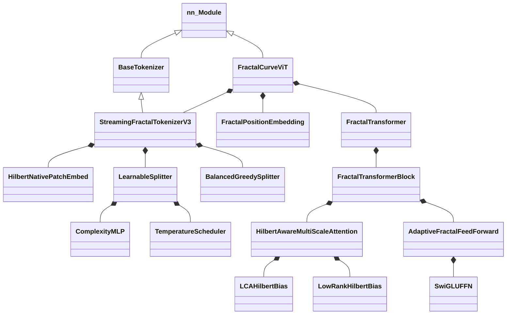

# 附录

## A. 类层次结构



---

## B. 数据流图

```
1. 输入图像 (B, C, H, W)
        │
        ▼
2. StreamingFractalTokenizerV3
   ├── GumbelTopKSplitter (方案 D/E)
   │   └── ROI-Pool → MLP → Gumbel-Softmax → Top-K
   ├── HilbertNativePatchEmbed
   │   └── t = Pool(F[R]) · σ_d + E_d
   └── HilbertIndexer (重排序)
        │
        ▼
3. TokenizerOutput
   ├── tokens: (B, N, D)
   └── levels: (B, N, max_depth+1)
        │
        ▼
4. 批次填充
   ├── padded_tokens: (B, N_max, D)
   ├── padded_levels: (B, N_max, Info)
   └── mask: (B, N_max)
        │
        ▼
5. FractalPositionEmbedding
   └── E_pos = Fusion(E_depth(d) + E_path(p))
        │
        ▼
6. 添加 CLS Token → (B, N_max+1, D)
        │
        ▼
7. FractalTransformer × L
   ├── 级别感知 LayerNorm
   ├── HilbertAwareMultiScaleAttention
   │   ├── QKV 投影
   │   ├── 级别缩放
   │   ├── Hilbert 偏置 (LCA)
   │   └── 级别偏置
   ├── DropPath + 残差
   ├── 级别感知 LayerNorm
   ├── AdaptiveFractalFeedForward (SwiGLU)
   └── DropPath + 残差
        │
        ▼
8. 级别聚合器
        │
        ▼
9. 池化 (CLS / Mean)
        │
        ▼
10. MLP 头
    └── LN → Linear → GELU → Linear
        │
        ▼
11. Logits (B, num_classes)
```

---

## C. 超参数参考

### 模型参数

| 参数 | CIFAR-10 | Tiny-ImageNet | ImageNet |
|:----------|:---------|:--------------|:---------|
| `dim` | 192 | 256 | 512 |
| `depth` | 9 | 10 | 12 |
| `heads` | 6 | 8 | 8 |
| `mlp_dim` | 384 | 1024 | 2048 |
| `patch_size` | 4 | 4 | 16 |
| `max_depth` | 3 | 4 | 4 |

### 训练参数

| 参数 | 默认值 | 范围 |
|:----------|:--------|:------|
| `lr` | 5e-4 | [1e-4, 1e-3] |
| `weight_decay` | 0.03 | [0.01, 0.1] |
| `dropout` | 0.1 | [0.0, 0.2] |
| `drop_path` | 0.1 | [0.0, 0.2] |
| `warmup_epochs` | 5 | [3, 10] |
| `batch_size` | 128 | [64, 256] |

### 分词器参数

| 参数 | 默认值 | 范围 | 描述 |
|:----------|:--------|:------|:------------|
| `alpha` | 0.5 | [0.3, 0.7] | 方差权重 |
| `tau_0` | 0.15 | [0.08, 0.25] | 根阈值 |
| `gamma` | 0.85 | [0.75, 0.92] | 衰减因子 |
| `sigma_0_sq` | 0.01 | [0.005, 0.03] | 方差归一化 |
| `g_0_sq` | 0.08 | [0.03, 0.15] | 梯度归一化 |

---

## D. API 快速参考

### 模型初始化

```python
from vit_pytorch import FractalCurveViT, FractalConfig

# 方法 1: 直接参数
model = FractalCurveViT(
    image_size=224,
    num_classes=1000,
    dim=384,
    num_layers=12,
    heads=6,
    mlp_dim=768,
    ffn_type='swiglu_level',
)

# 方法 2: 使用 FractalConfig
config = FractalConfig(image_size=224, min_patch_size=4)
model = FractalCurveViT(
    image_size=224,
    num_classes=1000,
    dim=384,
    heads=6,
)
```

### 前向传播

```python
# 基本用法
logits = model(images)  # (B, num_classes)

# 带辅助信息
logits, aux = model(images, return_aux_info=True)
```

### 独立分词器

```python
from vit_pytorch import StreamingFractalTokenizerV3

tokenizer = StreamingFractalTokenizerV3(
    image_size=224,
    d_model=384,
    base_patch_size=4,
    max_depth=4,
    split_scheme='balanced_greedy',
)

output = tokenizer.tokenize(images)
for seq in output.sequences:
    print(f"Tokens: {seq.tokens.shape}")
    print(f"Levels: {seq.get_levels().shape}")
```

### 独立组件

```python
from vit_pytorch import (
    ManifoldNativeAttention,
    SwiGLUFFN,
    FractalPositionEmbedding,
    HierarchicalAttentionBias,
)

# 注意力
attn = ManifoldNativeAttention(
    dim=384, heads=6, max_level=8, beta=4.0
)

# FFN
ffn = SwiGLUFFN(dim=384, hidden_dim=512)

# 位置嵌入
pos_emb = FractalPositionEmbedding(dim=384, max_level=50)

# 层级注意力偏置
from vit_pytorch import FractalConfig
config = FractalConfig(image_size=224)
hier_bias = HierarchicalAttentionBias(config=config, heads=6)
```

---

## E. 常见导入

```python
# 核心模型
from vit_pytorch import FractalCurveViT

# 配置
from vit_pytorch import FractalConfig
from vit_pytorch.split_adaptive import AdaptiveSplitConfig

# 分词器
from vit_pytorch import StreamingFractalTokenizerV3

# 组件
from vit_pytorch import (
    HilbertAwareMultiScaleAttention,
    LCAHilbertBias,
    LowRankHilbertBias,
    SwiGLUFFN,
    AdaptiveFractalFeedForward,
    FractalPositionEmbedding,
    FractalTransformer,
)

# 工具
from vit_pytorch.utils import extract_depths, normalize_levels_info
from vit_pytorch.curve_hilbert import HilbertCurve
```

---

## F. 数学符号

| 符号 | 定义 |
|:-------|:-----------|
| $I$ | 输入图像 $\in \mathbb{R}^{C \times H \times W}$ |
| $T$ | Token 序列 $\in \mathbb{R}^{N \times D}$ |
| $L$ | 级别信息 $\in \mathbb{Z}^{N \times (d_{max}+1)}$ |
| $d$ | 四叉树深度 $\in [0, d_{max}]$ |
| $p$ | 四叉树路径 $\in [0,3]^{d}$ |
| $C(R)$ | 区域复杂度 $\in [0, 1]$ |
| $\tau_d$ | 深度相关阈值 |
| $H$ | Hilbert 曲线映射 |
| $\text{LCA}(i,j)$ | 最近公共祖先深度 |
| $B_{hilbert}$ | Hilbert 注意力偏置 |
| $\alpha_d$ | 级别混合权重 |

---

## H. 验证框架与行动路线图

### H.1 核心矛盾：稀疏性 ↔ 梯度流

**这是一个不可能三角**：

```
            稀疏性
              ▲
             / \
            /   \
           /  ✗  \
          /       \
        梯度 ◁────▷ 树一致性
```

任何方案只能同时优化两个目标。

### H.2 关键问题清单

在继续优化之前，必须回答这些问题：

#### H.2.1 局部性验证
- [ ] H1SS 的实际 Locality Efficiency 测量值是多少？
- [ ] H-entmax 的 Locality Efficiency 与 H1SS 有显著差异吗？
- [ ] 如果差异 < 5%，为什么需要 DistanceDecay Conv？

#### H.2.2 树约束验证
- [ ] 树约束真的减少了树一致性违反吗？
- [ ] λ 课程学习的最佳值是多少？
- [ ] 如果 λ=0.1 和 λ=0.3 效果相同，为什么要课程学习？

#### H.2.3 梯度验证
- [ ] H1SS 早期（α=1.2）的梯度覆盖率真的 100% 吗？
- [ ] H1SS 晚期（α≈1.49）的梯度覆盖率是多少？
- [ ] 梯度覆盖率与最终精度有相关性吗？

#### H.2.4 选择稳定性验证
- [ ] 相同输入的选择 IOU 是多少？
- [ ] 选择的不稳定性会影响训练收敛吗？
- [ ] Dropout/batchnorm 如何影响确定性？

#### H.2.5 深度分布验证
- [ ] 实际深度分布是什么？
- [ ] 是否过度集中于某个深度？
- [ ] 深度分布与精度有相关性吗？

### H.3 消融实验设计

| 实验 | H1SS 变体 | 预期结果 | 如何验证 |
|:-----|:----------|:---------|:---------|
| A | 移除树约束 | Locality↑? Tree↓? | Tree Consistency Score |
| B | 移除 SDS | Locality↓? 性能? | Locality Efficiency |
| C | 固定 α=1.5 | 梯度消失? 性能? | Gradient Coverage |
| D | 移除 K 课程 | 早期不稳定? | Selection IOU |
| E | Conv1D vs DistanceDecay | 性能差异? | End-to-end Accuracy |

### H.4 决策矩阵

| 验证结果 | 行动 |
|:---------|:-----|
| Locality Efficiency 差异 < 5% | 移除 DistanceDecay Conv1D |
| Tree Consistency 差异 ≈ 0 | 移除树约束 |
| α=1.49 固定 = 调度版本 | 移除 α 调度 |
| 所有上述成立 | 采用 HilbertSplitterV2 简化架构 |
| 深度分布熵过早塌缩 | 启用 Soft-Halting 策略 |
| 跨阶特征不对齐 | 引入 Super Token Up-sampling |

### H.5 风险评估

| 风险 | 影响 | 缓解措施 |
|:-----|:-----|:---------|
| 简化后精度下降 | 高 | 保留 Ablation 作为回退选项 |
| 树一致性违反增加 | 中 | 添加简单的硬约束（非课程学习） |
| 选择稳定性下降 | 中 | 使用温度退火而非完全确定性 |
| Halting 陷入局部最优 | 高 | Soft-Halting 早期 → Hard-Halting 中后期 |
| 分形阶数跳变特征不连续 | 高 | SViT Super Token + Implicit Up-sampling |
| Python Dispatch 开销大 | 中 | Triton/CUDA Fused Kernel |

### H.6 行动路线图

#### 第一优先级：验证核心假设

**问题 1**：DistanceDecay Conv 是否有效？
```
如果 Locality Efficiency 差异 < 5%，则 DistanceDecay 是无效复杂性
验证方法：Ablation E (Conv1D vs DistanceDecay)
决策点：差异小 → 简化为标准 Conv1D
```

**问题 2**：树约束是否必要？
```
如果移除树约束后 Tree Consistency 不下降，则树约束是无效复杂性
验证方法：Ablation A (移除树约束)
决策点：差异小 → 移除树约束
```

**问题 3**：α 调度是否有效？
```
如果固定 α=1.49 与调度版本效果相同，则调度是无效复杂性
验证方法：Ablation C (固定 α=1.5)
决策点：差异小 → 简化为固定调度
```

#### 第二优先级：统一架构

**统一假设**：H1SS 和 H-entmax 的本质区别仅在于：
1. 邻域复杂度提取方式（DistanceDecay Conv1D vs Standard Conv1D）
2. 树约束机制
3. α 调度策略

**统一架构设计**：

```python
HilbertSplitterV2:
├── HilbertLocalComplexity (H-Entmax)      # 可学习的 Conv1D
├── (可选) TreeConstraint: simple λ=0.1   # 硬编码，非课程
├── EntmaxAlpha: 固定 1.5 或 1.49          # 无调度
└── K 选择: TopK after Entmax
```

**预期收益**：
- 参数：10K → 2K（5x 简化）
- 调度器：5+ → 0（完全移除）
- 可维护性：大幅提升

#### 第三优先级：探索新方向

**方向 1**：适应性窗口大小
```
当前：固定 kernel_size=5
改进：根据局部信息密度动态调整窗口
参考：A-ViT 的 halting score 机制
```

**方向 2**：可学习的距离衰减
```
当前：w_d = 1/(|d|+1) 固定
改进：w_d = softmax(gap, temperature)
其中 gap 是数据驱动的距离嵌入
```

**方向 3**：两阶段选择
```
Stage 1：粗筛（Entmax α=1.2，保留 50% tokens）
Stage 2：精筛（Entmax α=1.5，保留 K tokens）
参考：CF-ViT 的粗到细策略
```

---

## G. 文件参考

| 文件 | 主要类 |
|:-----|:----------------|
| `model_fractal_vit.py` | `FractalCurveViT` |
| `tokenizer_streaming.py` | `StreamingFractalTokenizerV3` |
| `split_adaptive.py` | `BalancedGreedySplitter`, `FixedBudgetDPSplitter`, `LearnableSplitter` |
| `attn_hilbert_bias.py` | `HilbertAwareMultiScaleAttention`, `LCAHilbertBias`, `LowRankHilbertBias` |
| `ffn_swiglu.py` | `SwiGLUFFN`, `AdaptiveFractalFeedForward` |
| `embed_fractal_position.py` | `FractalPositionEmbedding` |
| `embed_hilbert_patch.py` | `HilbertNativePatchEmbed` |
| `block_transformer.py` | `FractalTransformer`, `FractalTransformerBlock` |
| `curve_hilbert.py` | `HilbertCurve`, `PseudoHilbertCurve` |
| `config_fractal.py` | `FractalConfig` |
| `base_tokenizer.py` | `BaseTokenizer`, `TokenizerOutput` |
| `utils.py` | 工具函数 |
| `constants.py` | 默认超参数 |
