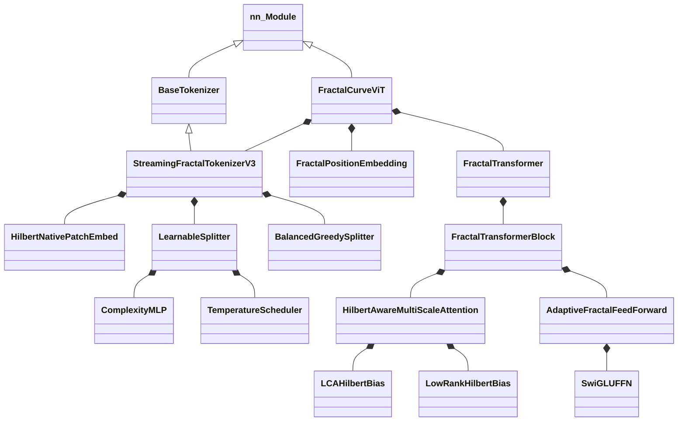

# 附录

## A. 类层次结构



---

## B. 数据流图

```
1. 输入图像 (B, C, H, W)
        │
        ▼
2. StreamingFractalTokenizerV3
   ├── GumbelTopKSplitter (方案 D/E)
   │   └── ROI-Pool → MLP → Gumbel-Softmax → Top-K
   ├── HilbertNativePatchEmbed
   │   └── t = Pool(F[R]) · σ_d + E_d
   └── HilbertIndexer (重排序)
        │
        ▼
3. TokenizerOutput
   ├── tokens: (B, N, D)
   └── levels: (B, N, max_depth+1)
        │
        ▼
4. 批次填充
   ├── padded_tokens: (B, N_max, D)
   ├── padded_levels: (B, N_max, Info)
   └── mask: (B, N_max)
        │
        ▼
5. FractalPositionEmbedding
   └── E_pos = Fusion(E_depth(d) + E_path(p))
        │
        ▼
6. 添加 CLS Token → (B, N_max+1, D)
        │
        ▼
7. FractalTransformer × L
   ├── 级别感知 LayerNorm
   ├── HilbertAwareMultiScaleAttention
   │   ├── QKV 投影
   │   ├── 级别缩放
   │   ├── Hilbert 偏置 (LCA)
   │   └── 级别偏置
   ├── DropPath + 残差
   ├── 级别感知 LayerNorm
   ├── AdaptiveFractalFeedForward (SwiGLU)
   └── DropPath + 残差
        │
        ▼
8. 级别聚合器
        │
        ▼
9. 池化 (CLS / Mean)
        │
        ▼
10. MLP 头
    └── LN → Linear → GELU → Linear
        │
        ▼
11. Logits (B, num_classes)
```

---

## C. 超参数参考

### 模型参数

| 参数 | CIFAR-10 | Tiny-ImageNet | ImageNet |
|:----------|:---------|:--------------|:---------|
| `dim` | 192 | 256 | 512 |
| `depth` | 9 | 10 | 12 |
| `heads` | 6 | 8 | 8 |
| `mlp_dim` | 384 | 1024 | 2048 |
| `patch_size` | 4 | 4 | 16 |
| `max_depth` | 3 | 4 | 4 |

### 训练参数

| 参数 | 默认值 | 范围 |
|:----------|:--------|:------|
| `lr` | 5e-4 | [1e-4, 1e-3] |
| `weight_decay` | 0.03 | [0.01, 0.1] |
| `dropout` | 0.1 | [0.0, 0.2] |
| `drop_path` | 0.1 | [0.0, 0.2] |
| `warmup_epochs` | 5 | [3, 10] |
| `batch_size` | 128 | [64, 256] |

### 分词器参数

| 参数 | 默认值 | 范围 | 描述 |
|:----------|:--------|:------|:------------|
| `alpha` | 0.5 | [0.3, 0.7] | 方差权重 |
| `tau_0` | 0.15 | [0.08, 0.25] | 根阈值 |
| `gamma` | 0.85 | [0.75, 0.92] | 衰减因子 |
| `sigma_0_sq` | 0.01 | [0.005, 0.03] | 方差归一化 |
| `g_0_sq` | 0.08 | [0.03, 0.15] | 梯度归一化 |

---

## D. API 快速参考

### 模型初始化

```python
from vit_pytorch import FractalCurveViT, FractalConfig

# 方法 1: 直接参数
model = FractalCurveViT(
    image_size=224,
    num_classes=1000,
    dim=384,
    num_layers=12,
    heads=6,
    mlp_dim=768,
    ffn_type='swiglu_level',
)

# 方法 2: 使用 FractalConfig
config = FractalConfig(image_size=224, min_patch_size=4)
model = FractalCurveViT(
    image_size=224,
    num_classes=1000,
    dim=384,
    heads=6,
)
```

### 前向传播

```python
# 基本用法
logits = model(images)  # (B, num_classes)

# 带辅助信息
logits, aux = model(images, return_aux_info=True)
```

### 独立分词器

```python
from vit_pytorch import StreamingFractalTokenizerV3

tokenizer = StreamingFractalTokenizerV3(
    image_size=224,
    d_model=384,
    base_patch_size=4,
    max_depth=4,
    split_scheme='balanced_greedy',
)

output = tokenizer.tokenize(images)
for seq in output.sequences:
    print(f"Tokens: {seq.tokens.shape}")
    print(f"Levels: {seq.get_levels().shape}")
```

### 独立组件

```python
from vit_pytorch import (
    ManifoldNativeAttention,
    SwiGLUFFN,
    FractalPositionEmbedding,
    HierarchicalAttentionBias,
)

# 注意力
attn = ManifoldNativeAttention(
    dim=384, heads=6, max_level=8, beta=4.0
)

# FFN
ffn = SwiGLUFFN(dim=384, hidden_dim=512)

# 位置嵌入
pos_emb = FractalPositionEmbedding(dim=384, max_level=50)

# 层级注意力偏置
from vit_pytorch import FractalConfig
config = FractalConfig(image_size=224)
hier_bias = HierarchicalAttentionBias(config=config, heads=6)
```

---

## E. 常见导入

```python
# 核心模型
from vit_pytorch import FractalCurveViT

# 配置
from vit_pytorch import FractalConfig
from vit_pytorch.split_adaptive import AdaptiveSplitConfig

# 分词器
from vit_pytorch import StreamingFractalTokenizerV3

# 组件
from vit_pytorch import (
    HilbertAwareMultiScaleAttention,
    LCAHilbertBias,
    LowRankHilbertBias,
    SwiGLUFFN,
    AdaptiveFractalFeedForward,
    FractalPositionEmbedding,
    FractalTransformer,
)

# 工具
from vit_pytorch.utils import extract_depths, normalize_levels_info
from vit_pytorch.curve_hilbert import HilbertCurve
```

---

## F. 数学符号

| 符号 | 定义 |
|:-------|:-----------|
| $I$ | 输入图像 $\in \mathbb{R}^{C \times H \times W}$ |
| $T$ | Token 序列 $\in \mathbb{R}^{N \times D}$ |
| $L$ | 级别信息 $\in \mathbb{Z}^{N \times (d_{max}+1)}$ |
| $d$ | 四叉树深度 $\in [0, d_{max}]$ |
| $p$ | 四叉树路径 $\in [0,3]^{d}$ |
| $C(R)$ | 区域复杂度 $\in [0, 1]$ |
| $\tau_d$ | 深度相关阈值 |
| $H$ | Hilbert 曲线映射 |
| $\text{LCA}(i,j)$ | 最近公共祖先深度 |
| $B_{hilbert}$ | Hilbert 注意力偏置 |
| $\alpha_d$ | 级别混合权重 |

---

## G. 文件参考

| 文件 | 主要类 |
|:-----|:----------------|
| `model_fractal_vit.py` | `FractalCurveViT` |
| `tokenizer_streaming.py` | `StreamingFractalTokenizerV3` |
| `split_adaptive.py` | `BalancedGreedySplitter`, `FixedBudgetDPSplitter`, `LearnableSplitter` |
| `attn_hilbert_bias.py` | `HilbertAwareMultiScaleAttention`, `LCAHilbertBias`, `LowRankHilbertBias` |
| `ffn_swiglu.py` | `SwiGLUFFN`, `AdaptiveFractalFeedForward` |
| `embed_fractal_position.py` | `FractalPositionEmbedding` |
| `embed_hilbert_patch.py` | `HilbertNativePatchEmbed` |
| `block_transformer.py` | `FractalTransformer`, `FractalTransformerBlock` |
| `curve_hilbert.py` | `HilbertCurve`, `PseudoHilbertCurve` |
| `config_fractal.py` | `FractalConfig` |
| `base_tokenizer.py` | `BaseTokenizer`, `TokenizerOutput` |
| `utils.py` | 工具函数 |
| `constants.py` | 默认超参数 |
