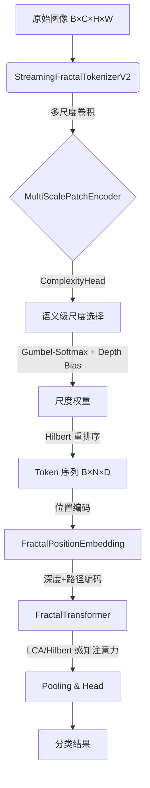

# 项目概览与架构

## 1.1 项目简介

**Fractal Curve Tokenizer** 是一个实验性的视觉 Transformer 架构，旨在验证 Hilbert 曲线分形 tokenization 对 ViT 的可行性。

* **核心理念**: 利用 Hilbert 曲线的空间局部性保持特性，将 2D 图像转换为 1D 序列时保留邻近关系。
* **技术手段**: 结合多尺度卷积金字塔和 Hilbert 曲线遍历，实现端到端可微的 tokenization。

## 1.2 顶层数据流架构



**数学形式化**:
$$I \xrightarrow{T} (T, L) \xrightarrow{E_{pos}} T' \xrightarrow{\text{Transformer}} X' \xrightarrow{\text{Pool}} z \xrightarrow{\text{MLP}} \hat{y}$$

其中:

- $I \in \mathbb{R}^{B \times C \times H \times W}$: 输入图像
- $T \in \mathbb{R}^{B \times N \times D}$: Token 嵌入
- $L \in \mathbb{Z}^{B \times N \times \text{Info}}$: 层级信息 (深度 + 四叉树路径)

## 1.3 模块映射 (v0.6.0+)

| 层级          | 模块  | 对应文件                     | 核心功能                                                    |
|:----------- |:--- |:------------------------ |:------------------------------------------------------- |
| **Layer 4** | 应用层 | `fractal_vit.py`         | `FractalCurveViT`                              |
| **Layer 3** | 管道层 | `streaming_tokenizer.py` | `StreamingFractalTokenizerV2` (推荐)                      |
|             |     | `transformer.py`         | `FractalTransformer`                                    |
| **Layer 2** | 组件层 | `attention.py`           | `HilbertAwareMultiScaleAttention`, **`LCAHilbertBias`** |
|             |     | `feedforward.py`         | `SwiGLUFFN`, `AdaptiveFractalFeedForward`               |
|             |     | `positional.py`          | `FractalPositionEmbedding`                              |
| **Layer 1** | 基础层 | `hilbert.py`             | `HilbertCurve`, `PseudoHilbertCurve`                    |
|             |     | `fractal_config.py`      | **`FractalConfig`** (统一配置)                              |
|             |     | `fractal_path.py`        | `VectorizedPathEncoder`                                 |
|             |     | `tokenization.py`        | `BaseTokenizer`, `TokenizerOutput`                      |
|             |     | `constants.py`           | 超参数默认值                                                  |
|             |     | `utils.py`               | 工具函数                                                    |

## 1.4 核心创新点

| 特性                      | 描述                             | 状态     |
| ----------------------- | ------------------------------ | ------ |
| **LCA Hilbert Bias**    | 利用四叉树 LCA 深度编码空间距离，参数量 ~100    | ✅ 默认推荐 |
| **Gumbel-Softmax 尺度选择** | 端到端可微的自适应尺度选择                  | ✅ 稳定   |
| **深度探索优先 Warmup**       | 训练初期偏向小尺度 (深层级)，后期自主决策         | ✅ v2.2 |
| **语义级复杂度估计**            | 复用 Encoder 特征，消除 ~75% 冗余 FLOPs | ✅ v2.0 |
| **SwiGLU + 层级自适应**      | LLaMA 风格 FFN，带层级感知             | ✅ 推荐   |
| **P0 训练配置优化**          | mlp_dim=4×, dropout=0.1, variable_tokens=False | ✅ v0.7.0 |

## 1.5 阅读指南

建议按以下顺序阅读文档：

1. **03_fractal_tokenizer.md**: 理解 StreamingFractalTokenizerV2 的多尺度 tokenization
2. **08_fractal_vit_model.md**: 理解宏观架构，数据如何在各个模块间传递
3. **07_transformer_encoder.md**: 理解核心计算单元
4. **05_attention_mechanism.md**: 理解 Hilbert 感知注意力和 **LCA Bias (推荐)**
5. **04_positional_embedding.md**: 理解深度+路径编码
6. **06_feedforward_network.md**: 理解 SwiGLU 前馈网络

## 1.6 快速开始

```python
from vit_pytorch import FractalCurveViT
from vit_pytorch.fractal_config import FractalConfig

# 方式 1: 使用 FractalConfig (推荐)
config = FractalConfig(image_size=64, min_patch_size=4)
# 自动推导: max_depth=4, num_scales=5, patch_sizes=(4,8,16,32,64)

# 方式 2: 直接创建模型 (推荐配置 for Tiny-ImageNet)
model = FractalCurveViT(
    image_size=64,
    num_classes=200,
    dim=256,
    depth=10,
    heads=8,
    mlp_dim=1024,                   # 4× dim (P0 修复)
    tokenizer_type='streaming_v2',  # 推荐
    ffn_type='swiglu_level',        # 推荐
    variable_tokens=False,          # 推荐，训练更稳定
    dropout=0.1,                    # P0 修复: 0.3→0.1
)

# 前向传播
logits = model(images)  # (B, 200)
```
