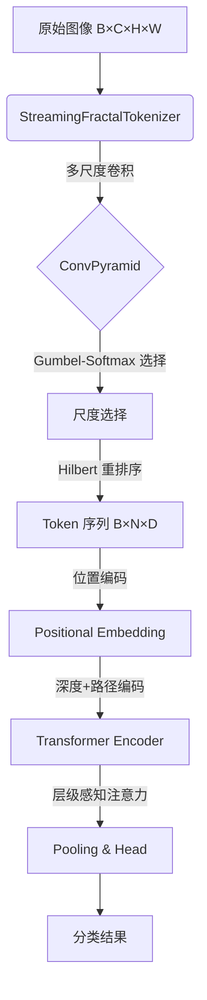

# 项目概览与架构

## 1.1 项目简介
**Fractal Curve Tokenizer** 是一个实验性的视觉 Transformer 架构，旨在验证 Hilbert 曲线分形 tokenization 对 ViT 的可行性。

*   **核心理念**: 利用 Hilbert 曲线的空间局部性保持特性，将 2D 图像转换为 1D 序列时保留邻近关系。
*   **技术手段**: 结合多尺度卷积金字塔和 Hilbert 曲线遍历，实现端到端可微的 tokenization。

## 1.2 顶层数据流架构

**数学形式化**:
$$I \xrightarrow{T} (T, L) \xrightarrow{E_{pos}} T' \xrightarrow{\text{Transformer}} X' \xrightarrow{\text{Pool}} z \xrightarrow{\text{MLP}} \hat{y}$$

其中:
- $I \in \mathbb{R}^{B \times C \times H \times W}$: 输入图像
- $T \in \mathbb{R}^{B \times N \times D}$: Token 嵌入
- $L \in \mathbb{Z}^{B \times N}$: 层级信息

## 1.3 模块映射 (v0.5.0+)

| 层级 | 模块 | 对应文件 | 核心功能 |
| :--- | :--- | :--- | :--- |
| **Layer 4** | 应用层 | `fractal_vit.py` | `NextGenerationFractalViT` |
| **Layer 3** | 管道层 | `streaming_tokenizer.py` | `StreamingFractalTokenizer`, V2 |
| | | `transformer.py` | `EnhancedFractalTransformer` |
| **Layer 2** | 组件层 | `attention.py` | `HilbertAwareMultiScaleAttention` |
| | | `feedforward.py` | `SwiGLUFFN`, `AdaptiveFractalFeedForward` |
| | | `positional.py` | `AdvancedFractalPositionEmbedding` |
| **Layer 1** | 基础层 | `hilbert.py` | `HilbertCurve` (d ↔ (x,y) 映射) |
| | | `tokenization.py` | `BaseTokenizer`, `TokenizerOutput` |
| | | `constants.py` | 超参数默认值 |
| | | `utils.py` | 工具函数 |

## 1.4 阅读指南
建议按以下顺序阅读文档：
1.  **03_fractal_tokenizer.md**: 理解 StreamingFractalTokenizer 的多尺度 tokenization
2.  **08_fractal_vit_model.md**: 理解宏观架构，数据如何在各个模块间传递
3.  **07_transformer_encoder.md**: 理解核心计算单元
4.  **05_attention_mechanism.md**: 理解 Hilbert 感知注意力和 Low-Rank Bias
5.  **04_positional_embedding.md**: 理解深度+路径编码
6.  **06_feedforward_network.md**: 理解 SwiGLU 前馈网络
