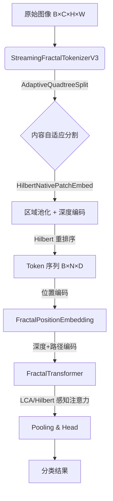

# 项目概览与架构

## 1.1 项目简介

**Fractal Curve Tokenizer** 是一个实验性的视觉 Transformer 架构，旨在验证 Hilbert 曲线分形 tokenization 对 ViT 的可行性。

* **核心理念**: 利用 Hilbert 曲线的空间局部性保持特性，将 2D 图像转换为 1D 序列时保留邻近关系。
* **技术手段**: 结合多尺度卷积金字塔和 Hilbert 曲线遍历，实现端到端可微的 tokenization。

## 1.2 顶层数据流架构



**数学形式化**:
$$I \xrightarrow{T} (T, L) \xrightarrow{E_{pos}} T' \xrightarrow{\text{Transformer}} X' \xrightarrow{\text{Pool}} z \xrightarrow{\text{MLP}} \hat{y}$$

其中:

- $I \in \mathbb{R}^{B \times C \times H \times W}$: 输入图像
- $T \in \mathbb{R}^{B \times N \times D}$: Token 嵌入
- $L \in \mathbb{Z}^{B \times N \times \text{Info}}$: 层级信息 (深度 + 四叉树路径)

## 1.3 模块映射 (v0.8.0+)

| 层级          | 模块  | 对应文件                     | 核心功能                                                    |
|:----------- |:--- |:------------------------ |:------------------------------------------------------- |
| **Layer 4** | 应用层 | `model_fractal_vit.py`   | `FractalCurveViT`                                       |
| **Layer 3** | 管道层 | `tokenizer_streaming.py` | `StreamingFractalTokenizerV3` (✅ 唯一支持)                |
|             |     | `block_transformer.py`   | `FractalTransformer`                                    |
| **Layer 2** | 组件层 | `attn_hilbert_bias.py`   | `HilbertAwareMultiScaleAttention`, **`LCAHilbertBias`** |
|             |     | `split_adaptive.py`      | `BalancedGreedySplitter`, `FixedBudgetDPSplitter`       |
|             |     | `embed_hilbert_patch.py` | `HilbertNativePatchEmbed` + ROI-Align                   |
|             |     | `ffn_swiglu.py`          | `SwiGLUFFN`, `AdaptiveFractalFeedForward`               |
|             |     | `embed_fractal_position.py` | `FractalPositionEmbedding`                           |
| **Layer 1** | 基础层 | `curve_hilbert.py`       | `HilbertCurve`, `PseudoHilbertCurve`                    |
|             |     | `config_fractal.py`      | **`FractalConfig`** (统一配置)                              |
|             |     | `embed_fractal_path.py`  | `VectorizedPathEncoder`                                 |
|             |     | `base_tokenizer.py`      | `BaseTokenizer`, `TokenizerOutput`                      |
|             |     | `constants.py`           | 超参数默认值                                                  |
|             |     | `utils.py`               | 工具函数                                                    |

> **注意**: V1 (`StreamingFractalTokenizer`) 和 V2 (Gumbel-Softmax) 已从代码库完全移除。当前仅支持 V3。

## 1.4 核心创新点

| 特性                      | 描述                             | 状态     |
| ----------------------- | ------------------------------ | ------ |
| **Variable Depth Tokens (V3)** | 自适应四叉树分割 + 区域池化，消除尺度崩塌 | ✅ **默认推荐** |
| **LCA Hilbert Bias**    | 利用四叉树 LCA 深度编码空间距离，参数量 ~100    | ✅ 默认推荐 |
| **HilbertNativePatchEmbed** | 共享卷积 + 深度调制，满足 4 大数学约束 | ✅ 新增 |
| **AdaptiveQuadtreeSplit** | 方差+梯度复杂度估计，贪心/DP 分割方案 | ✅ 新增 |
| **SwiGLU + 层级自适应**      | LLaMA 风格 FFN，带层级感知             | ✅ 推荐   |
| **P0 训练配置优化**          | mlp_dim=4×, dropout=0.1, variable_tokens=False | ✅ v0.7.0 |

## 1.5 阅读指南

建议按以下顺序阅读文档：

1. **03_fractal_tokenizer.md**: 理解 StreamingFractalTokenizerV3 的 Variable Depth tokenization
2. **08_fractal_vit_model.md**: 理解宏观架构，数据如何在各个模块间传递
3. **07_transformer_encoder.md**: 理解核心计算单元
4. **05_attention_mechanism.md**: 理解 Hilbert 感知注意力和 **LCA Bias (推荐)**
5. **04_positional_embedding.md**: 理解深度+路径编码
6. **06_feedforward_network.md**: 理解 SwiGLU 前馈网络

## 1.6 快速开始

```python
from vit_pytorch import FractalCurveViT
from vit_pytorch.fractal_config import FractalConfig

# 方式 1: 使用 FractalConfig (推荐)
config = FractalConfig(image_size=64, min_patch_size=4)
# 自动推导: max_depth=4, num_scales=5, patch_sizes=(4,8,16,32,64)

# 方式 2: 直接创建模型 (推荐配置 for Tiny-ImageNet)
model = FractalCurveViT(
    image_size=64,
    num_classes=200,
    dim=256,
    depth=10,
    heads=8,
    mlp_dim=1024,                   # 4× dim (P0 修复)
    tokenizer_type='streaming_v3',  # ✅ 推荐 (Variable Depth Tokens)
    ffn_type='swiglu_level',        # 推荐
    dropout=0.1,                    # P0 修复: 0.3→0.1
)

# 前向传播
logits = model(images)  # (B, 200)
```
