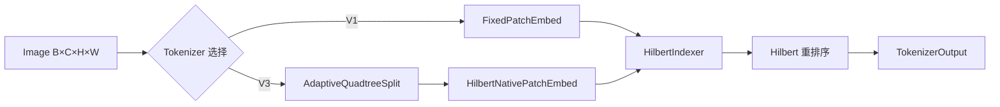

# 第三章：分形 Tokenizer 核心 (streaming_tokenizer.py)

本章详尽描述了图像数据如何通过流式分形分词器被转化为 Token 序列。这是整个模型的数据入口。

## 3.1 数据流概览



**数学形式化**:
$$T: \mathbb{R}^{B \times C \times H \times W} \to (\mathbb{R}^{B \times N \times D}, \mathbb{Z}^{B \times N \times (d_{max}+1)})$$

其中：
- $N$ = Token 数量（V1 固定，V3 自适应）
- $D$ = Token 维度
- $d_{max}+1$ = 层级信息维度 `[depth, q1, q2, ..., q_d]`

---

## 3.2 架构演进历史

| 版本 | 架构名称 | 核心机制 | 状态 |
|:-----|:--------|:---------|:-----|
| V1 | Fixed Multi-Scale | 固定卷积金字塔 | ✅ 稳定 |
| V2 | Gumbel-Softmax | STE 自适应选择 | ❌ **已删除** |
| V3 旧 | Cross-Scale Attention | 学习尺度权重 | ❌ **已重构** |
| V3 新 | **Variable Depth Tokens** | 自适应四叉树分割 | ✅ **推荐** |

> **重要**: V2 (Gumbel-Softmax) 已从代码库完全移除。V3 于 2025-12-25 从 Cross-Scale Attention 重构为 Variable Depth Tokens 架构。

---

## 3.3 核心类：HilbertIndexer

预计算 Hilbert 曲线索引，用于特征重排序。支持标准 Hilbert 曲线和 Pseudo-Hilbert 曲线（针对非正方形图像）。

### 数学定义

**标准 Hilbert 曲线** (当 $H = W = 2^k$):
$$H: [0, n^2) \leftrightarrow [0, n) \times [0, n)$$

**Pseudo-Hilbert 曲线** (任意 $H \times W$ 矩形):
$$PH_{H,W}: [0, H \times W) \to [0, H) \times [0, W)$$

**递归定义** (Zhang & Kamata, 2007):
1. 若 $H = W = 2^k$: 使用标准 Hilbert 曲线
2. 若 $H > W$: 水平分割，递归处理并连接
3. 若 $W > H$: 垂直分割，递归处理并连接

**性质**:
- **局部性保持**: $\|p_i - p_{i+1}\|_2 \le C \approx 1.5\sqrt{2}$
- **自适应性**: 无需 Padding 即可处理任意尺寸图像

### 缓存机制 (HilbertPathCache)

```python
class HilbertPathCache:
    """Device-aware LRU 缓存
    
    缓存键: (grid_h, grid_w, max_depth, device)
    缓存内容: hilbert_to_raster 映射和 quadtree_paths
    """
```

---

## 3.4 核心类：StreamingFractalTokenizer (V1)

固定多尺度 tokenization，不涉及动态选择。

### 初始化参数

| 参数            | 类型  | 默认值 | 说明          |
|:------------- |:--- |:--- |:----------- |
| `image_size`  | int | -   | 输入图像尺寸      |
| `dim`         | int | -   | 输出 token 维度 |
| `patch_size`  | int | 8   | 基础 patch 尺寸 |
| `in_channels` | int | 3   | 输入通道数       |

### tokenize() 方法

**输入**: `images` 张量 `(B, C, H, W)`

**流程**:
1. **卷积编码**: 通过 `patch_embed` 卷积层提取特征
2. **展平**: 将特征图展平为序列
3. **Hilbert 重排序**: 使用 `HilbertIndexer` 重排序
4. **层级信息生成**: 固定深度 = 0

**输出**: `TokenizerOutput` 包含 B 个 `TokenSequence`

---

## 3.5 核心类：StreamingFractalTokenizerV3 (✅ 推荐)

### 3.5.1 架构概述

Variable Depth Tokens (VDT) 架构使用**内容自适应四叉树分割**代替学习权重：

```python
旧架构 (Cross-Scale Attention) - 已废弃:
    F_s = MultiScaleConv(I)           # 多尺度特征
    α_{i,s} = softmax(Q_i · K_{i,s})  # 学习尺度权重
    Token_i = Σ_s α_{i,s} · V_{i,s}   # 加权融合
    问题: α 必然崩塌到单尺度 (信息论必然性)

新架构 (Variable Depth Tokens) - 当前:
    Regions = AdaptiveQuadtreeSplit(I)  # 内容自适应分割
    F = SharedConv(I)                    # 共享特征提取
    Token_i = Pool(F[R_i]) * σ_d + E_d  # 区域池化 + 深度编码
    优势: 深度由内容决定，非学习崩塌
```

### 3.5.2 数学约束

V3 满足四个核心数学约束：

| 约束 | 符号 | 描述 |
|:-----|:-----|:-----|
| **C1** 维度一致性 | $\text{Embed}(R_i) \in \mathbb{R}^{dim}, \forall i, \forall d_i$ | 不同大小 region → 相同维度 |
| **C2** Hilbert 路径一致性 | $\text{HilbertPath}(\text{center}(R_i))[:d_i] = \text{QuadtreePath}(R_i)$ | 保持四叉树路径信息 |
| **C3** 尺度等变性 | $\text{Embed}(R_i) \approx \sigma \cdot \text{Embed}(R_j) + \text{bias}$ | 相同内容不同尺度有数学联系 |
| **C4** LCA 兼容性 | $\text{LCA\_depth}(\text{path}_i, \text{path}_j)$ 对 Transformer bias 有效 | 与 LCA 偏置协同工作 |

### 3.5.3 初始化参数

| 参数                   | 类型         | 默认值              | 说明                  |
|:-------------------- |:---------- |:---------------- |:------------------- |
| `image_size`         | int/Tuple  | 224              | 输入图像尺寸              |
| `channels`           | int        | 3                | 图像通道数               |
| `d_model`            | int        | 256              | 输出 token 维度         |
| `base_patch_size`    | int        | 4                | 最细粒度 patch 大小       |
| `max_depth`          | int        | 4                | 最大四叉树深度             |
| `use_hilbert_order`  | bool       | True             | 是否使用 Hilbert 排序     |
| `split_scheme`       | str        | 'balanced_greedy'| 分割方案 (见 3.6 节)      |
| `target_tokens`      | int/None   | None             | 目标 token 数量         |
| `complexity_alpha`   | float      | 0.5              | 复杂度函数方差权重          |
| `enforce_balance`    | bool       | True             | 是否强制 2:1 平衡约束       |

### 3.5.4 tokenize() 方法

**流程**:

```
1. AdaptiveQuadtreeSplit(Image) → List[SplitResult]
2. HilbertNativePatchEmbed(Image, SplitResults) → (tokens, levels_info)
3. HilbertSort(tokens) → ordered tokens
4. Build TokenizerOutput
```

**输入**: `images: Tensor[B, C, H, W]`

**输出**: `TokenizerOutput` 包含:
- `tokens`: `[B, N, d_model]` Token 嵌入
- `levels_info`: `[B, N, max_depth+1]` 层级信息 `[depth, q1, q2, ...]`
- `metadata.split_stats`: 分割统计信息

---

## 3.6 自适应四叉树分割 (adaptive_split.py)

### 3.6.1 核心数学：复杂度函数

**复杂度定义**:
$$C(R) = \alpha \cdot C_{var}(R) + (1-\alpha) \cdot C_{grad}(R)$$

其中：
- $C_{var}(R) = \frac{\text{Var}(R)}{\text{Var}(R) + \sigma_0^2}$ — 归一化方差（纹理敏感）
- $C_{grad}(R) = \frac{G(R)}{G(R) + g_0^2}$ — 归一化梯度能量（边缘敏感）
- $\alpha \in [0, 1]$ — 平衡权重（默认 0.5）

**深度相关阈值**:
$$\tau_d = \tau_0 \cdot \gamma^d$$

| 参数 | 默认值 | 含义 |
|:-----|:------|:-----|
| $\tau_0$ | 0.15 | 根阈值 |
| $\gamma$ | 0.85 | 衰减因子 |
| $\sigma_0^2$ | 0.01 | 方差归一化常数 |
| $g_0^2$ | 0.08 | 梯度归一化常数 |

### 3.6.2 分割方案

**Scheme B: Balanced Greedy Splitting (推荐)**

```python
config = AdaptiveSplitConfig.scheme_b(
    max_depth=4,
    alpha=0.5,
    enforce_balance=True,  # 2:1 平衡约束
    target_tokens=64,      # 软目标
)
splitter = BalancedGreedySplitter(config)
```

特点：
- 贪心策略，优先分割高复杂度区域
- 强制相邻区域深度差 ≤ 1 (2:1 平衡)
- 适合实时推理

**Scheme C: Fixed Budget Dynamic Programming**

```python
config = AdaptiveSplitConfig.scheme_c(
    token_budget=64,
    max_depth=4,
    alpha=0.5,
)
splitter = FixedBudgetDPSplitter(config)
```

特点：
- 动态规划全局最优
- 固定 token 数量
- 计算开销较大

### 3.6.3 四叉树-Hilbert 同构

**关键定理**:
$$\text{QuadtreePath}(R) = [q_1, q_2, \ldots, q_d] \iff \text{HilbertSegment}(R) = H|_{[a,b]}$$

四叉象限 $q_i \in \{0, 1, 2, 3\}$ 对应 Hilbert 曲线的连续区间。

---

## 3.7 Hilbert-Native Patch Embedding (patch_embed.py)

### 3.7.1 Region Pooling 方案 (方案 C+)

**公式**:
$$F = \text{SharedConv}(I) \in \mathbb{R}^{B \times D \times \frac{H}{p} \times \frac{W}{p}}$$

对于深度 $d_i$ 的区域 $R_i$:
$$t_i = \text{AdaptiveAvgPool2d}(1)(F[:, :, y_1:y_2, x_1:x_2]) \cdot \sigma_{d_i} + E_{depth}(d_i)$$

其中：
- $\sigma_{d_i}$ — 深度缩放因子（乘法）
- $E_{depth}(d_i)$ — 深度嵌入向量（加法）

### 3.7.2 参数量分析

| 组件 | 参数量 | 说明 |
|:-----|:------|:-----|
| SharedConv | ~12K | $D \times C \times p \times p$ |
| depth_embed | ~1.3K | $(d_{max}+1) \times D$ |
| depth_scale | ~5 | $d_{max}+1$ |
| **总计** | **~14K** | vs 4.2M (Depth-Specific Conv) |

### 3.7.3 深度缩放初始化

```python
def _init_depth_scale(self) -> None:
    """σ_d = 1.0 + 0.05 * d / max_depth ∈ [1.0, 1.05]
    
    深层 (细粒度): 信息密度高 → 略大权重
    浅层 (粗粒度): 信息稀释 → 略小权重
    """
```

---

## 3.8 使用示例

### 创建 V3 Tokenizer (推荐)

```python
from vit_pytorch import StreamingFractalTokenizerV3

# 创建 Variable Depth tokenizer
tokenizer = StreamingFractalTokenizerV3(
    image_size=224,
    channels=3,
    d_model=256,
    base_patch_size=4,
    max_depth=4,
    split_scheme='balanced_greedy',
    target_tokens=64,
    complexity_alpha=0.5,
    enforce_balance=True,
)

# Tokenize
images = torch.randn(2, 3, 224, 224)
output = tokenizer.tokenize(images)

# 输出结构
print(f"Token 数量: {output.sequences[0].tokens.shape[0]}")
print(f"Token 维度: {output.sequences[0].tokens.shape[1]}")
print(f"层级信息: {output.sequences[0].metadata['levels'].shape}")

# 获取分割统计
stats = tokenizer.get_split_stats()
print(f"每图像 token 数: {stats['num_tokens']}")
print(f"深度分布: {stats['depth_distributions']}")
```

### 诊断方法

```python
# 训练状态统计
stats = tokenizer.get_training_stats()
# {
#     'tokenizer_version': 'v3_variable_depth',
#     'architecture': 'adaptive_quadtree_split + hilbert_native_embed',
#     'split_scheme': 'balanced_greedy',
#     'max_depth': 4,
#     'avg_tokens_per_image': 48.5,
#     'depth_entropy': 1.234,
# }

# 深度分布熵 (多样性指标)
entropy = tokenizer.get_scale_entropy()
print(f"深度熵: {entropy:.3f}")
```

---

## 3.9 V1 vs V3 对比

| 特性 | V1 (Fixed) | V3 (Variable Depth) |
|:-----|:-----------|:--------------------|
| **Token 数量** | 固定 $(H/p)^2$ | 自适应 $\in [N_{min}, N_{max}]$ |
| **分割方式** | 固定网格 | 内容自适应四叉树 |
| **深度信息** | 固定 depth=0 | Variable depth ∈ [0, d_max] |
| **复杂度感知** | 无 | 方差 + 梯度 |
| **参数量** | ~12K | ~14K |
| **计算开销** | 低 | 中 |
| **推荐场景** | 简单任务/基线 | 复杂图像/生产环境 |

---

## 3.10 与旧版架构对比

| 特性           | BFS + REINFORCE (旧) | Gumbel-Softmax (V2, 已删除) | Variable Depth (V3) |
|:------------ |:------------------- |:-------------------------- |:------------------- |
| **分割方式**     | 递归四叉树 + 策略采样     | 卷积金字塔 + STE              | 自适应四叉树 + 区域池化   |
| **可微性**      | 不可微，需 REINFORCE    | 端到端可微 (STE)             | 端到端可微           |
| **梯度流**      | 高方差                 | 稀疏 (~20% 尺度有梯度)        | 密集 (全区域)        |
| **温度调度**    | -                    | 需要 Gumbel 温度退火          | 无需              |
| **Token 数量** | 变长                   | 固定/可变                    | 自适应             |
| **GPU 效率**   | 低（Python 循环）        | 高                         | 高                |
| **状态**       | 废弃                   | **已删除**                   | ✅ 推荐            |

---

## 3.11 附录：数学符号表

| 符号 | 含义 |
|:-----|:-----|
| $I$ | 输入图像 $\in \mathbb{R}^{B \times C \times H \times W}$ |
| $R_i$ | 第 $i$ 个区域 (由四叉树分割产生) |
| $d_i$ | 区域 $R_i$ 的深度 $\in \{0, 1, \ldots, d_{max}\}$ |
| $q_j$ | 第 $j$ 层四叉象限索引 $\in \{0, 1, 2, 3\}$ |
| $C(R)$ | 区域复杂度函数 |
| $\tau_d$ | 深度 $d$ 的分割阈值 |
| $\sigma_d$ | 深度 $d$ 的缩放因子 |
| $E_{depth}(d)$ | 深度 $d$ 的嵌入向量 |
| $F$ | 共享卷积特征图 |
| $t_i$ | 区域 $R_i$ 的 token 嵌入 |
