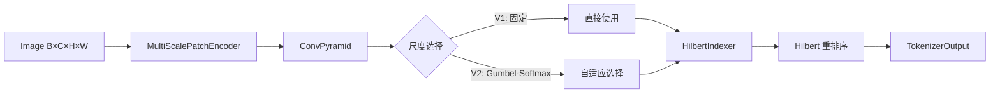

# 第三章：分形 Tokenizer 核心 (streaming_tokenizer.py)

本章详尽描述了图像数据如何通过流式分形分词器被转化为 Token 序列。这是整个模型的数据入口。

## 3.1 数据流概览



**数学形式化**:
$$T: \mathbb{R}^{B \times C \times H \times W} \to (\mathbb{R}^{B \times N \times D}, \mathbb{Z}^{B \times N})$$

其中 $N = \frac{H}{p} \times \frac{W}{p}$ 是固定的 token 数量。

---

## 3.2 核心类：MultiScalePatchEncoder

多尺度卷积金字塔，为每个尺度生成特征图。

### 数学定义
$$F_s = \text{Conv}_s(I), \quad s \in \{1, \ldots, S\}$$

每个尺度的卷积配置：
- `kernel_size = stride = patch_size_s`
- 输出维度：`dim`

### 代码结构
```python
class MultiScalePatchEncoder(nn.Module):
    def __init__(self, in_channels, dim, scales):
        # scales: List[int], 如 [4, 8, 16]
        self.encoders = nn.ModuleList([
            nn.Conv2d(in_channels, dim, kernel_size=s, stride=s)
            for s in scales
        ])
```

### 输出
- 多个特征图：`List[Tensor]`，每个形状为 `(B, D, H/s, W/s)`

---

## 3.3 核心类：HilbertIndexer

预计算 Hilbert 曲线索引，用于特征重排序。

### 数学定义
$$H: \text{Grid}_{h \times w} \to \text{Seq}_{n}$$

将 2D 网格按 Hilbert 曲线顺序展平为 1D 序列。

### 接口
```python
@staticmethod
@lru_cache(maxsize=64)
def get_hilbert_order(grid_size: int) -> torch.Tensor:
    """返回索引张量，将光栅顺序映射到 Hilbert 顺序。"""
```

### 特点
- 使用 `@lru_cache` 缓存，避免重复计算
- 调用 `HilbertCurve.d_to_xy()` 进行坐标转换

---

## 3.4 核心类：StreamingFractalTokenizer (V1)

固定多尺度 tokenization，不涉及动态选择。

### 初始化参数
| 参数 | 类型 | 默认值 | 说明 |
| :--- | :--- | :--- | :--- |
| `image_size` | int | - | 输入图像尺寸 |
| `dim` | int | - | 输出 token 维度 |
| `patch_size` | int | 8 | 基础 patch 尺寸 |
| `in_channels` | int | 3 | 输入通道数 |

### tokenize() 方法

**输入**: `images` 张量 `(B, C, H, W)`

**流程**:
1. **卷积编码**: 通过 `patch_embed` 卷积层提取特征
2. **展平**: 将特征图展平为序列
3. **Hilbert 重排序**: 使用 `HilbertIndexer` 重排序
4. **层级信息生成**: 固定深度 = 0

**输出**: `TokenizerOutput` 包含 B 个 `TokenSequence`

---

## 3.5 核心类：StreamingFractalTokenizerV2 (推荐)

使用 Gumbel-Softmax 实现端到端可微的尺度选择。

### 数学定义

**尺度分数计算**:
$$\pi_{ij} = \text{softmax}(\text{ScoreNet}(F_{ij}) / \tau)$$

**Gumbel-Softmax (训练时)**:
$$\hat{\pi}_k = \frac{\exp((\log \pi_k + g_k) / \tau)}{\sum_l \exp((\log \pi_l + g_l) / \tau)}$$

其中 $g_k \sim \text{Gumbel}(0, 1)$

**硬选择 (推理时)**:
$$s^* = \arg\max_s \pi_s$$

### 初始化参数
| 参数 | 类型 | 默认值 | 说明 |
| :--- | :--- | :--- | :--- |
| `image_size` | int | - | 输入图像尺寸 |
| `dim` | int | - | 输出 token 维度 |
| `scales` | List[int] | [4, 8, 16] | 可选尺度列表 |
| `temperature` | float | 1.0 | Gumbel-Softmax 温度 |
| `in_channels` | int | 3 | 输入通道数 |

### tokenize() 方法

**流程**:
1. **多尺度编码**: 通过 `MultiScalePatchEncoder` 提取多尺度特征
2. **尺度分数**: 对每个位置计算各尺度的分数
3. **尺度选择**:
   - 训练: Gumbel-Softmax 软选择
   - 推理: argmax 硬选择
4. **特征融合**: 加权组合各尺度特征
5. **Hilbert 重排序**: 按 Hilbert 顺序重排

**输出**: `TokenizerOutput`

---

## 3.6 与旧版 FractalHilbertTokenizer 的对比

| 特性 | 旧版 (BFS + REINFORCE) | 新版 (Streaming) |
| :--- | :--- | :--- |
| **分割方式** | 递归四叉树 | 固定网格 |
| **决策机制** | 策略网络 + 采样 | 卷积 + Gumbel-Softmax |
| **可微性** | 不可微，需 REINFORCE | 端到端可微 |
| **Token 数量** | 变长 | 固定 |
| **GPU 效率** | 低（Python 循环） | 高（全 GPU 执行） |
| **训练稳定性** | 低（高方差） | 高 |

---

## 3.7 使用示例

```python
from vit_pytorch import StreamingFractalTokenizerV2

# 创建 tokenizer
tokenizer = StreamingFractalTokenizerV2(
    image_size=224,
    dim=384,
    scales=[4, 8, 16],
    temperature=1.0,
)

# Tokenize
images = torch.randn(2, 3, 224, 224)
output = tokenizer.tokenize(images)

# 输出结构
print(len(output.sequences))  # 2
print(output.sequences[0].tokens.shape)  # (N, 384)
```
