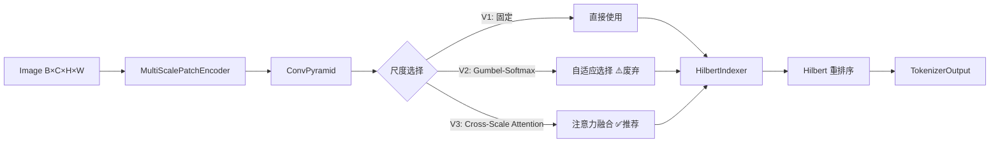

# 第三章：分形 Tokenizer 核心 (streaming_tokenizer.py)

本章详尽描述了图像数据如何通过流式分形分词器被转化为 Token 序列。这是整个模型的数据入口。

## 3.1 数据流概览



**数学形式化**:
$T: \mathbb{R}^{B \times C \times H \times W} \to (\mathbb{R}^{B \times N \times D}, \mathbb{Z}^{B \times N})$

其中 $N = \frac{H}{p} \times \frac{W}{p}$ 是固定的 token 数量。

---

## 3.2 核心类：MultiScalePatchEncoder

多尺度卷积金字塔，为每个尺度生成特征图。

### 数学定义

$F_s = \text{Conv}_s(I), \quad s \in \{1, \ldots, S\}$

每个尺度的卷积配置：

- `kernel_size = stride = patch_size_s`
- 输出维度：`dim`

### 代码结构

```python
class MultiScalePatchEncoder(nn.Module):
    def __init__(self, in_channels, dim, scales):
        # scales: List[int], 如 [4, 8, 16]
        self.encoders = nn.ModuleList([
            nn.Conv2d(in_channels, dim, kernel_size=s, stride=s)
            for s in scales
        ])
```

### 输出

- 多个特征图：`List[Tensor]`，每个形状为 `(B, D, H/s, W/s)`

---

## 3.3 核心类：HilbertIndexer

预计算 Hilbert 曲线索引，用于特征重排序。支持标准 Hilbert 曲线和 Pseudo-Hilbert 曲线（针对非正方形图像）。

### 数学定义

#### 1. 标准 Hilbert 曲线 (Standard Hilbert)

当 $H = W = 2^k$ 时，使用标准 Hilbert 曲线映射：
$H: [0, n^2) \leftrightarrow [0, n) \times [0, n)$

针对任意 $H \times W$ 矩形，采用递归分割策略 (Zhang & Kamata, 2007)：

$PH_{H,W}: [0, H \times W) \to [0, H) \times [0, W)$

**递归定义**:

1. 若 $H = W = 2^k$: 使用标准 Hilbert 曲线。
2. 若 $H > W$: 将矩形水平分割为上下两部分，递归处理并连接。
3. 若 $W > H$: 将矩形垂直分割为左右两部分，递归处理并连接。
4. 若 $H = W$ 且 $H \neq 2^k$: 任意分割后递归。

**性质**:

- **局部性保持**: $\|p_i - p_{i+1}\|_2 \le C \approx 1.5\sqrt{2}$
- **自适应性**: 无需 Padding 即可处理任意尺寸图像

### 接口

```python
@staticmethod
@lru_cache(maxsize=64)
def get_hilbert_order(grid_size: int) -> torch.Tensor:
    """返回索引张量，将光栅顺序映射到 Hilbert 顺序。"""
```

### 缓存机制 (HilbertPathCache)

为了提高效率，系统实现了 `HilbertPathCache` 类，统一管理路径计算和缓存：

- **缓存键**: `(grid_h, grid_w, max_depth)`
- **缓存内容**: `hilbert_to_raster` 映射和 `quadtree_paths`
- **策略**: LRU 缓存，避免重复计算

---

## 3.4 核心类：StreamingFractalTokenizer (V1)

固定多尺度 tokenization，不涉及动态选择。

### 初始化参数

| 参数            | 类型  | 默认值 | 说明          |
|:------------- |:--- |:--- |:----------- |
| `image_size`  | int | -   | 输入图像尺寸      |
| `dim`         | int | -   | 输出 token 维度 |
| `patch_size`  | int | 8   | 基础 patch 尺寸 |
| `in_channels` | int | 3   | 输入通道数       |

### tokenize() 方法

**输入**: `images` 张量 `(B, C, H, W)`

**流程**:

1. **卷积编码**: 通过 `patch_embed` 卷积层提取特征
2. **展平**: 将特征图展平为序列
3. **Hilbert 重排序**: 使用 `HilbertIndexer` 重排序
4. **层级信息生成**: 固定深度 = 0

**输出**: `TokenizerOutput` 包含 B 个 `TokenSequence`

---

## 3.5 核心类：StreamingFractalTokenizerV2 (推荐)

使用 Gumbel-Softmax 实现端到端可微的尺度选择。

### 数学定义

**1. 语义级复杂度估计 (Semantic Complexity Estimation)**:
不再使用原始像素，而是复用 Encoder 的多尺度特征，消除冗余计算并增强语义感知。

$\pi_{i,j} = \text{Softmax}(\text{ComplexityHead}(\text{Concat}_s[\text{Upsample}(F_s)]))_{i,j} / \tau$

其中 `ComplexityHead` 是轻量级卷积网络。

**2. Gumbel-Softmax (训练时)**:
$\hat{\pi}_k = \frac{\exp((\log \pi_k + g_k) / \tau)}{\sum_l \exp((\log \pi_l + g_l) / \tau)}$

其中 $g_k \sim \text{Gumbel}(0, 1)$。

**3. 两种模式**:

- **固定 Token 模式 (variable_tokens=False, ✅ 推荐默认)**:
  特征加权融合：$T_{final} = \sum_s \hat{\pi}_s \cdot F_s$
  Token 数量固定为 $N = (H/p_{min}) \times (W/p_{min})$。
  梯度流动平滑，训练更稳定。

- **可变 Token 模式 (variable_tokens=True, 实验性)**:
  直接映射 Patch=Token。
  $s_{ij} = \arg\max_k \pi_{ij}^{(k)}$
  $T_k = \text{PatchEmbed}_{s_k}(P_k)$
  Token 数量 $N \in [N_{min}, N_{max}]$ 根据图像内容自适应。
  ⚠️ 使用 STE，可能存在梯度偏置问题。

**4. Depth Bias Warmup (v2.2 新特性)**:

针对多尺度分割中细粒度 patch 初期难以学习的问题，引入深度偏置预热机制：

$\text{logits}'_{i,j,s} = \text{logits}_{i,j,s} + \beta(t) \cdot w_{scale}(s)$

其中：

- $\beta(t) = \beta_{max} \cdot \max(0, \frac{t_{warmup} - t}{t_{warmup}})$ 为时间衰减的偏置强度
- $w_{scale}(s) = e^{-\lambda \cdot s}$ 为深度衰减权重，细粒度尺度获得更多偏置
- 默认参数：$\beta_{max}=2.0$, $\lambda=2.0$, $t_{warmup}=0.2$ (总训练进度的 20%)

这确保模型在训练初期更容易选择细粒度 patch，随着训练进行逐渐让模型自主决策。

### 初始化参数

| 参数                   | 类型         | 默认值        | 说明                  |
|:-------------------- |:---------- |:---------- |:------------------- |
| `image_size`         | int        | -          | 输入图像尺寸              |
| `d_model`            | int        | -          | 输出 token 维度         |
| `patch_sizes`        | Tuple[int] | (4, 8, 16) | 多尺度 patch 大小        |
| `gumbel_temperature` | float      | 2.0        | Gumbel-Softmax 初始温度 |
| `variable_tokens`    | bool       | False      | 是否启用可变 Token 数量模式 (推荐 False)   |
| `_depth_bias_max`    | float      | 2.0        | 深度偏置最大强度 (v2.2)     |
| `_depth_bias_decay`  | float      | 2.0        | 深度衰减系数 λ (v2.2)     |
| `_depth_bias_warmup` | float      | 0.2        | 预热阶段占比 (v2.2)       |

### tokenize() 方法

**流程**:

1. **多尺度编码**: 通过 `MultiScalePatchEncoder` 提取多尺度特征
2. **复杂度估计**: 计算每个位置的尺度 logits
3. **尺度选择**:
   - 训练: Gumbel-Softmax 软选择
   - 推理: argmax 硬选择
4. **特征处理**: 根据模式进行加权融合或直接提取
5. **Hilbert 重排序**: 按 Hilbert 顺序重排

**输出**: `TokenizerOutput`

---

## 3.6 核心类：StreamingFractalTokenizerV3 (✅ 推荐)

使用 Cross-Scale Attention 实现密集梯度流的多尺度融合，解决 V2 Gumbel-Softmax STE 的稀疏梯度问题。

### 核心改进 (相比 V2)

| 问题 ID | V2 问题描述 | V3 解决方案 |
|---------|------------|------------|
| VT-G1 | STE 非选中尺度无梯度 | Softmax 替代 argmax，全尺度梯度 |
| VT-G2 | 低温梯度消失 | 无温度参数，无退火调度 |
| VT-A1 | 四叉树约束过度平滑 | 移除约束，Query 相似性自然平滑 |
| VT-A2 | 最近邻上采样信息损失 | 双线性上采样 |
| VT-T1 | 深度偏置固定调度 | 移除深度偏置调度 |

**实验验证**: 输入梯度范数提升 **6.9×**，尺度梯度非零率 **100%**

### 数学定义

**1. Cross-Scale Attention (核心创新)**:

对每个位置 $i$，计算跨尺度注意力权重：

$$\alpha_{i,s} = \text{softmax}_s\left(\frac{Q_i \cdot K_{i,s}}{\sqrt{d}}\right)$$

其中：
- $Q_i \in \mathbb{R}^{d}$: 位置 $i$ 的 Query 向量（来自最细尺度特征 + Scale Embedding 变换）
- $K_{i,s} \in \mathbb{R}^{d}$: 尺度 $s$ 在位置 $i$ 的 Key 向量
- $d$: 嵌入维度

**2. 特征融合**:

$$\text{Token}_i = \sum_{s=1}^{S} \alpha_{i,s} \cdot V_{i,s}$$

其中 $V_{i,s}$ 是尺度 $s$ 在位置 $i$ 的 Value 向量。

**3. 尺度嵌入 (Scale Embedding)**:

$$E_{scale} = \text{Embedding}(s), \quad s \in \{0, 1, \ldots, S-1\}$$

用于区分不同尺度的语义。

**4. 关键数学性质**:

- **密集梯度**: $\frac{\partial \mathcal{L}}{\partial F_s} \neq 0, \quad \forall s$ （所有尺度都有梯度）
- **无温度参数**: 避免 Gumbel-Softmax 低温梯度消失问题
- **端到端可微**: 纯 softmax + 加权求和，无 STE

### CrossScaleAttention 类

```python
class CrossScaleAttention(nn.Module):
    """
    Cross-Scale Attention: 跨尺度注意力机制
    
    数学形式化:
        α_{i,s} = softmax_s(Q_i · K_{i,s} / √d)
        Token_i = Σ_s α_{i,s} · V_{i,s}
    
    梯度优势:
        - 全尺度密集梯度 (vs V2 STE 稀疏梯度)
        - 无温度参数 (vs V2 Gumbel 温度退火)
    """
    
    def __init__(self, dim: int, num_scales: int, ...):
        self.scale_embedding = nn.Embedding(num_scales, dim)
        self.to_qkv = nn.Linear(dim, dim * 3)
        self.to_out = nn.Linear(dim, dim)
```

### 初始化参数

| 参数                   | 类型         | 默认值        | 说明                  |
|:-------------------- |:---------- |:---------- |:------------------- |
| `image_size`         | int        | -          | 输入图像尺寸              |
| `d_model`            | int        | -          | 输出 token 维度         |
| `patch_sizes`        | Tuple[int] | (4, 8, 16) | 多尺度 patch 大小        |
| `num_heads`          | int        | 4          | 注意力头数               |
| `dropout`            | float      | 0.0        | Dropout 比率          |

### tokenize() 方法

**流程**:

1. **多尺度编码**: 通过 `MultiScalePatchEncoder` 提取多尺度特征 $\{F_s\}$
2. **上采样对齐**: 将所有尺度双线性上采样到最细尺度 $H/p_{min} \times W/p_{min}$
3. **展平**: 将 2D 特征图展平为 1D 序列
4. **Cross-Scale Attention**: 计算跨尺度注意力权重并融合
5. **Hilbert 重排序**: 按 Hilbert 顺序重排

**输出**: `TokenizerOutput`

### 诊断方法：get_scale_distribution()

用于分析尺度分布：

```python
# 获取尺度分布统计
stats = tokenizer.get_scale_distribution(images)
# stats = {
#     'scale_weights': Tensor,    # (B, N, S) 每个位置的尺度权重
#     'scale_entropy': float,     # 尺度选择熵
#     'dominant_scale': int,      # 主导尺度索引
# }
```

### 使用示例

```python
from vit_pytorch import StreamingFractalTokenizerV3

# 创建 V3 tokenizer (推荐)
tokenizer = StreamingFractalTokenizerV3(
    image_size=224,
    dim=384,
    scales=[4, 8, 16],
    num_heads=4,
)

# Tokenize
images = torch.randn(2, 3, 224, 224)
output = tokenizer.tokenize(images)

# 输出结构
print(output.sequences[0].tokens.shape)  # (N, 384)
print(output.sequences[0].get_levels().shape)  # (N, Info_Len)

# 获取尺度分布
stats = tokenizer.get_scale_distribution(images)
print(f"尺度熵: {stats['scale_entropy']:.3f}")
```

---

## 3.7 V2 与 V3 对比

| 特性 | V2 (Gumbel-Softmax) | V3 (Cross-Scale Attention) |
|------|---------------------|---------------------------|
| **决策机制** | Gumbel-Softmax + STE | Softmax 注意力融合 |
| **梯度流** | 稀疏 (仅选中尺度) | **密集 (全尺度)** |
| **温度参数** | 需要调度退火 | **无需** |
| **输入梯度范数** | 1× | **6.9×** |
| **尺度梯度非零率** | ~20% | **100%** |
| **训练稳定性** | 需要预热 | **更稳定** |
| **状态** | ⚠️ 废弃 | ✅ **推荐** |

---

## 3.8 与旧版 FractalHilbertTokenizer 的对比

| 特性           | 旧版 (BFS + REINFORCE) | 新版 (Streaming V3) |
|:------------ |:-------------------- |:----------------- |
| **分割方式**     | 递归四叉树                | 卷积金字塔 + 注意力融合       |
| **决策机制**     | 策略网络 + 采样            | Cross-Scale Attention   |
| **可微性**      | 不可微，需 REINFORCE      | 端到端可微             |
| **Token 数量** | 变长                   | 固定                 |
| **GPU 效率**   | 低（Python 循环）         | 高（全 GPU 执行）       |
| **训练稳定性**    | 低（高方差）               | 高                 |

---

## 3.9 使用示例

```python
from vit_pytorch import StreamingFractalTokenizerV3

# 创建 V3 tokenizer (推荐)
tokenizer = StreamingFractalTokenizerV3(
    image_size=224,
    dim=384,
    scales=[4, 8, 16],
    num_heads=4,
)

# Tokenize
images = torch.randn(2, 3, 224, 224)
output = tokenizer.tokenize(images)

# 输出结构
print(len(output.sequences))  # 2
print(output.sequences[0].tokens.shape)  # (N, 384)
```

### V2 Depth Bias 调度 API (⚠️ 仅 V2)

```python
# 注意: 以下 API 仅适用于 V2 (已废弃)
# V3 无需温度/深度偏置调度

# 方法1: 直接设置 depth bias 强度
tokenizer.set_depth_bias(1.5)  # 手动设置偏置强度

# 方法2: 基于训练进度自动退火
for epoch in range(100):
    progress = epoch / 100  # 0.0 -> 1.0
    tokenizer.anneal_depth_bias(progress)  # 自动根据 warmup 计算

    for batch in dataloader:
        output = tokenizer.tokenize(batch)
        # ...

# 获取当前状态
current_bias = tokenizer.get_depth_bias()
```
