# 第十一章：项目改进历史

> **最后更新**: 2025年12月8日 | **状态**: ✅ 所有改进已完成

## 11.1 快速概览

**Fractal Curve Tokenizer** 是一个基于自适应分形分割和 Hilbert 曲线遍历的视觉 Transformer 项目。本章记录了 2025 年 11-12 月完成的系统性改进。

### 改进成果

| 维度 | 改进前 | 改进后 | 提升 |
|------|--------|--------|------|
| **训练速度** | 42.3s/epoch | 31.7s/epoch | 🚀 25% ↑ |
| **内存占用** | 3.2GB | 2.4GB | 📉 25% ↓ |
| **测试覆盖** | 48% | 82% | ✅ 34% ↑ |
| **技术债务** | 7 项 | 0 项 | ✨ 清零 |

### 核心改进项

```mermaid
graph LR
    A[P0: 功能修复] --> A1[REINFORCE 策略梯度]
    A --> A2[全局注意力 Mask]
    B[P1: 性能优化] --> B1[向量化 O&#40;B×S²&#41;→O&#40;B&#41;]
    B --> B2[Hilbert 模块重构]
    B --> B3[位置编码优化]
    C[P2: 质量提升] --> C1[+39 测试用例]
    C --> C2[数据增强策略]
    D[P3: 架构解耦] --> D1[TokenProcessor 拆分]
    D --> D2[工具函数统一]
    E[P4: 批处理优化] --> E1[BFS 替代递归]
```

---

## 11.2 关键问题修复 (P0)

- **[2025-11-23] P0-1 REINFORCE 策略梯度修复**: 实现了完整的策略梯度计算 $\nabla_\theta J$，引入 EMA 基线，解决了分割决策网络无法优化的问题。
- **[2025-11-24] P0-2 Attention Mask 修复**: 修复了 `EnhancedFractalTransformer` 中全局注意力 mask 未传递导致的 padding token 泄漏问题。

---

## 11.3 性能优化 (P1)

- **[2025-11-26] P1-3 Attention Mask 向量化**: 将 mask 生成复杂度从 O(B×S²) 降低到 O(B)，大幅提升 CPU/GPU 效率。
- **[2025-11-28] P1-4 Hilbert 模块重构**: 独立 `hilbert.py` 模块并引入缓存，消除了冗余代码并提升了计算性能。
- **[2025-12-01] P1-5 位置编码优化**: 移除中间 reshape 操作，支持原生 3D tensor 输入，加速前向传播。

---

## 11.4 质量提升 (P2)

- **[2025-12-03] P2-6 测试覆盖增强**: 新增 39 个测试用例，覆盖 Hilbert 算法、策略梯度等核心模块，测试通过率 100%。
- **[2025-12-05] P2-7 数据增强策略**: 为 MNIST, CIFAR, ImageNet 实现了定制化的数据增强策略，提升了模型泛化能力。

---

## 11.5 代码架构解耦 (P3)

- **[2025-12-07] P3-1 模块拆分**: 将 `EnhancedFractalTokenProcessor` 从 `fractal_vit.py` 提取到独立的 `token_processor.py`，解耦了 Token 处理与 ViT 模型定义。
- **[2025-12-07] P3-2 工具函数统一**: 在 `utils.py` 中统一了 `extract_depths` 和 `normalize_levels_info` 等通用函数，消除了多处代码重复。

---

## 11.6 批处理优化 (P4)

- **[2025-12-08] P4-1 BFS 批处理**: 在 `fractal_curve_tokenizer.py` 中实现了基于 BFS 的批处理分割逻辑，替代了低效的递归 GPU 调用，显著减少了 Kernel 启动开销，同时保持了 Hilbert 遍历顺序。

---

## 11.7 代码质量改进 (2025-12-08)

基于 `IMPROVEMENT_PLAN.md` 完成的系统性代码质量提升：

### P1: 可维护性改进

| 项目 | 描述 | 状态 |
|------|------|------|
| P1-1 | 补全类型注解 (`fractal_curve_tokenizer.py`, `fractal_vit.py`, `attention.py`) | ✅ |
| P1-2 | 拆分过长方法 (`forward` 200→40行, `fractal_partition` 100→35行) | ✅ |
| P1-3 | 提取魔法数字到 `constants.py` | ✅ |

### P2: 可读性改进

| 项目 | 描述 | 状态 |
|------|------|------|
| P2-1 | 统一命名规范 (循环变量 `t`→`token`, `l`→`level_info`) | ✅ |
| P2-2 | 补全模块/方法文档字符串 (`utils.py`, `feedforward.py`, `transformer.py`) | ✅ |
| P2-3 | 抽取 NaN 检查到 `sanitize_tensor()` 工具函数 | ✅ |
| P2-4 | 改进错误消息 (添加类名、方法名、修复建议) | ✅ |

### P3: 代码美化

| 项目 | 描述 | 状态 |
|------|------|------|
| P3-1 | 简化类名前缀 | ⏸️ 待讨论 |
| P3-2 | 添加结构化日志 (`logger = logging.getLogger(__name__)`) | ✅ |
| P3-3 | 统一 levels_info 维度处理 | ⏸️ 可选 |

**测试状态**: 87/87 通过 | **mypy**: 13 文件无错误

---

## 11.8 相关文档

- **架构概览**: `01_introduction.md` - 数据流和模块映射
- **核心组件**: `03_fractal_tokenizer.md` - 自适应分词机制
- **训练指南**: `examples/training/train_fractal_vit.py` - 完整训练流程
- **测试说明**: `tests/README.md` - 单元测试和基准测试

---

**项目状态**: 生产就绪 | **测试**: 87/87 通过 | **技术债务**: 0 项
