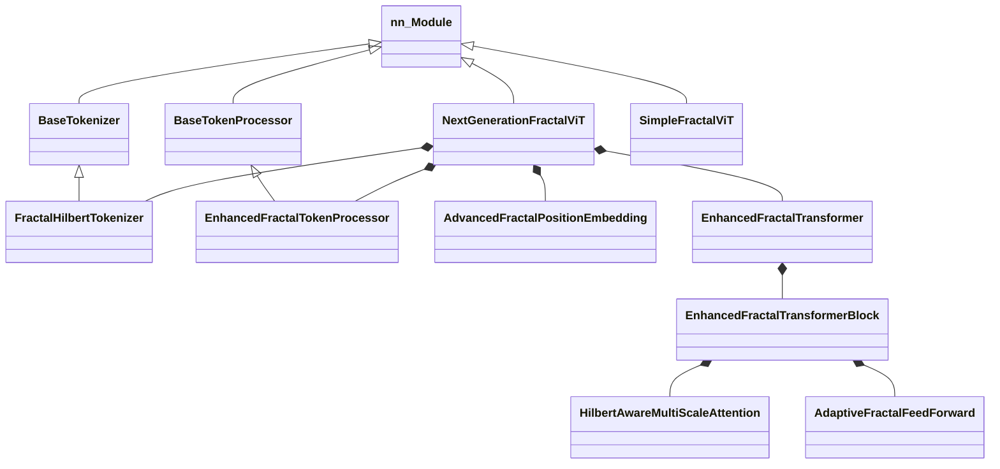

# 附录

## A. 类继承关系图



## B. 数据流向图

1.  **Input Image** `(B, C, H, W)`
2.  **Tokenizer** -> `TokenizerOutput` (List of `TokenSequence`)
    *   *Adaptive Split* -> Variable length tokens per image
3.  **Token Processor** -> `TokenizerOutput`
    *   *Projection & Enhancement*
4.  **Batch Padding** -> `Tensor` `(B, MaxLen, Dim)` + `Mask`
5.  **Position Embedding** -> Add `(B, MaxLen, Dim)`
6.  **Transformer Encoder** -> `Tensor` `(B, MaxLen, Dim)`
    *   *Masked Attention* prevents padding interaction
7.  **Pooling** -> `Tensor` `(B, Dim)`
8.  **MLP Head** -> `Logits` `(B, NumClasses)`

## C. 超参数参考表

| 参数名 | 推荐值 (CIFAR10) | 推荐值 (ImageNet) | 说明 |
| :--- | :--- | :--- | :--- |
| `dim` | 192 | 512 | Embedding 维度 |
| `depth` | 9 | 12 | Transformer 层数 |
| `heads` | 12 | 8 | Attention 头数 |
| `mlp_dim` | 384 | 2048 | FFN 隐藏层维度 |
| `min_patch_size` | (4, 4) | (16, 16) | 最小分割单元 |
| `max_level` | 4 | 5 | 最大递归深度 |
| `dropout` | 0.1 | 0.1 | Dropout 比率 |
| `lr` | 5e-4 | 1e-3 | 学习率 |

## D. API 快速参考

### 模型初始化

```python
model = NextGenerationFractalViT(
    image_size=256,
    num_classes=1000,
    dim=512,
    depth=6,
    heads=8,
    mlp_dim=1024,
    min_patch_size=(4, 4),
    max_level=5,
    learnable_split=True  # 启用可学习分割
)
```

### 前向传播

```python
# 返回 Logits
logits = model(img)

# 返回 Logits 和 辅助信息
logits, aux_infos = model(img, return_aux_info=True)
# aux_infos: List[Dict] 包含每个样本的 token 数量等信息
```

### 获取辅助 Loss

```python
# 在训练循环中调用
loss = criterion(logits, targets)
aux_loss = model.get_tokenizer_loss(reward=-loss.item())
total_loss = loss + aux_loss
```
