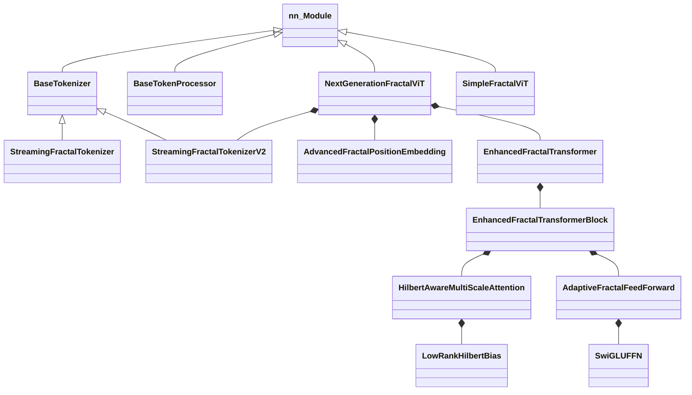

# 附录

## A. 类继承关系图



## B. 数据流向图

```
1. Input Image (B, C, H, W)
        │
        ▼
2. StreamingFractalTokenizer
   ├── MultiScalePatchEncoder (卷积金字塔)
   ├── Scale Selection (V2: Gumbel-Softmax)
   └── HilbertIndexer (Hilbert 重排序)
        │
        ▼
3. TokenizerOutput
   ├── tokens: (B, N, D)
   └── levels: (B, N, Info_Len)
        │
        ▼
4. Batch Padding
   ├── padded_tokens: (B, S_max, D)
   ├── padded_levels: (B, S_max, Info)
   └── mask: (B, S_max)
        │
        ▼
5. Position Embedding
   ├── Depth Embedding
   ├── Path Embedding
   └── Fusion Network
        │
        ▼
6. Add CLS Token → (B, S_max + 1, D)
        │
        ▼
7. Transformer Encoder
   ├── Level-Aware LayerNorm
   ├── HilbertAwareMultiScaleAttention
   │   ├── QKV Projection
   │   ├── Dot Product + Scale
   │   ├── Level Scaling
   │   ├── Hilbert Bias (Low-Rank)
   │   ├── Level Bias
   │   └── Softmax + Output
   ├── DropPath + Residual
   ├── Level-Aware LayerNorm
   ├── AdaptiveFractalFeedForward
   │   ├── SwiGLU (optional)
   │   └── Level Adaptation (optional)
   └── DropPath + Residual
        │
        ▼
8. Global Context Attention
        │
        ▼
9. Pooling (cls / mean)
        │
        ▼
10. MLP Head
    ├── LayerNorm
    ├── Linear → GELU → Dropout
    └── Linear
        │
        ▼
11. Logits (B, NumClasses)
```

## C. 超参数参考表

| 参数名 | 推荐值 (CIFAR10) | 推荐值 (ImageNet) | 说明 |
| :--- | :--- | :--- | :--- |
| `dim` | 192 | 512 | Embedding 维度 |
| `depth` | 9 | 12 | Transformer 层数 |
| `heads` | 6 | 8 | Attention 头数 |
| `mlp_dim` | 384 | 2048 | FFN 隐藏层维度 |
| `patch_size` | 4 | 16 | 基础 Patch 尺寸 |
| `scales` | [4, 8] | [8, 16, 32] | 多尺度配置 |
| `dropout` | 0.1 | 0.1 | Dropout 比率 |
| `drop_path` | 0.1 | 0.2 | DropPath 比率 |
| `lr` | 5e-4 | 1e-3 | 学习率 |
| `weight_decay` | 0.05 | 0.05 | 权重衰减 |
| `tokenizer_type` | streaming_v2 | streaming_v2 | Tokenizer 类型 |
| `bias_mode` | low_rank | low_rank | Hilbert Bias 模式 |
| `rank` | 32 | 64 | Low-Rank 秩 |
| `ffn_type` | swiglu_level | swiglu_level | FFN 类型 |

## D. API 快速参考

### 模型初始化

```python
from vit_pytorch import NextGenerationFractalViT

model = NextGenerationFractalViT(
    image_size=224,
    num_classes=1000,
    dim=384,
    depth=6,
    heads=6,
    mlp_dim=768,
    tokenizer_type='streaming_v2',  # 推荐
    bias_mode='low_rank',           # 推荐
    ffn_type='swiglu_level',        # 推荐
)
```

### 前向传播

```python
# 基本用法
logits = model(images)  # (B, num_classes)

# 获取辅助信息 (可选)
logits, aux_info = model(images, return_aux_info=True)
```

### Tokenizer 单独使用

```python
from vit_pytorch import StreamingFractalTokenizerV2

tokenizer = StreamingFractalTokenizerV2(
    image_size=224,
    dim=384,
    scales=[4, 8, 16],
    temperature=1.0,
)

output = tokenizer.tokenize(images)
# output.sequences[i].tokens: (N, D)
# output.sequences[i].get_levels(): (N, Info_Len)
```

### 组件单独使用

```python
from vit_pytorch import (
    HilbertAwareMultiScaleAttention,
    SwiGLUFFN,
    AdvancedFractalPositionEmbedding,
)

# 注意力
attn = HilbertAwareMultiScaleAttention(dim=384, heads=6, bias_mode='low_rank')

# FFN
ffn = SwiGLUFFN(dim=384, hidden_dim=512)

# 位置编码
pos_emb = AdvancedFractalPositionEmbedding(dim=384, max_level=50)
```

## E. 常用导入

```python
# 推荐导入 (v0.5.0+)
from vit_pytorch import (
    # 模型
    NextGenerationFractalViT,
    SimpleFractalViT,
    # Tokenizer
    StreamingFractalTokenizer,
    StreamingFractalTokenizerV2,
    # 组件
    EnhancedFractalTransformer,
    HilbertAwareMultiScaleAttention,
    AdaptiveFractalFeedForward,
    SwiGLUFFN,
    AdvancedFractalPositionEmbedding,
    # 基础
    HilbertCurve,
    TokenizerOutput,
    TokenSequence,
    # 工具
    extract_depths,
    normalize_levels_info,
)
```

## F. 数学符号表

| 符号 | 含义 |
| :--- | :--- |
| $I$ | 输入图像 $\in \mathbb{R}^{B \times C \times H \times W}$ |
| $T$ | Token 嵌入 $\in \mathbb{R}^{B \times N \times D}$ |
| $L$ | 层级信息 $\in \mathbb{Z}^{B \times N}$ |
| $E_{pos}$ | 位置编码函数 |
| $E_{depth}$ | 深度嵌入 |
| $E_{path}$ | 路径嵌入 |
| $B_{hilbert}$ | Hilbert 偏置矩阵 |
| $B_{level}$ | 层级偏置矩阵 |
| $\phi, \psi$ | Low-Rank 编码器 |
| $\sigma_{scale}$ | 层级缩放因子 |
| $\text{SwiGLU}$ | $W_{out}(\text{Swish}(W_g x) \odot W_v x)$ |
| $H$ | Hilbert 曲线映射 $[0, n^2) \leftrightarrow [0, n)^2$ |
