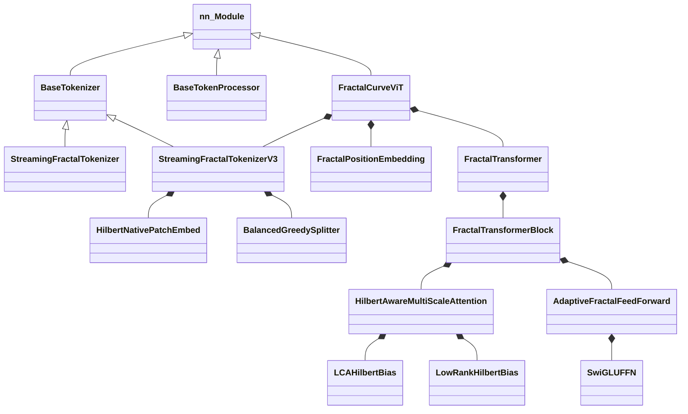

# 附录

## A. 类继承关系图



> **注意**: V2 (Gumbel-Softmax) 已从代码库完全移除。

## B. 数据流向图

```
1. Input Image (B, C, H, W)
        │
        ▼
2. StreamingFractalTokenizerV3
   ├── AdaptiveQuadtreeSplit (内容自适应分割)
   │   └── BalancedGreedySplitter / FixedBudgetDPSplitter
   ├── HilbertNativePatchEmbed (区域池化 + 深度编码)
   └── HilbertIndexer (Hilbert 重排序)
        │
        ▼
3. TokenizerOutput
   ├── tokens: (B, N, D)
   └── levels: (B, N, max_depth+1)
        │
        ▼
4. Batch Padding
   ├── padded_tokens: (B, S_max, D)
   ├── padded_levels: (B, S_max, Info)
   └── mask: (B, S_max)
        │
        ▼
5. FractalPositionEmbedding
   ├── Depth Embedding
   ├── Path Embedding
   └── Fusion Network
        │
        ▼
6. Add CLS Token → (B, S_max + 1, D)
        │
        ▼
7. FractalTransformer (FractalTransformerBlock × N)
   ├── Level-Aware LayerNorm
   ├── HilbertAwareMultiScaleAttention
   │   ├── QKV Projection
   │   ├── Dot Product + Scale
   │   ├── Level Scaling
   │   ├── Hilbert Bias (LCA)
   │   ├── Level Bias
   │   └── Softmax + Output
   ├── DropPath + Residual
   ├── Level-Aware LayerNorm
   ├── AdaptiveFractalFeedForward
   │   ├── SwiGLU (optional)
   │   └── Level Adaptation (optional)
   └── DropPath + Residual
        │
        ▼
8. Global Context Attention
        │
        ▼
9. Pooling (cls / mean)
        │
        ▼
10. MLP Head
    ├── LayerNorm
    ├── Linear → GELU → Dropout
    └── Linear
        │
        ▼
11. Logits (B, NumClasses)
```

## C. 超参数参考表

| 参数名              | 推荐值 (CIFAR10) | 推荐值 (ImageNet) | 说明                         |
|:---------------- |:------------- |:-------------- |:-------------------------- |
| `dim`            | 192           | 512            | Embedding 维度               |
| `depth`          | 9             | 12             | Transformer 层数             |
| `heads`          | 6             | 8              | Attention 头数               |
| `mlp_dim`        | 384           | 2048           | FFN 隐藏层维度                  |
| `patch_size`     | 4             | 16             | 基础 Patch 尺寸                |
| `scales`         | [4, 8]        | [8, 16, 32]    | 多尺度配置                      |
| `dropout`        | 0.1           | 0.1            | Dropout 比率 (P0 修复: 0.3→0.1) |
| `drop_path`      | 0.1           | 0.1            | DropPath 比率 (P0 修复: 0.2→0.1) |
| `lr`             | 5e-4          | 1e-4           | 学习率                        |
| `weight_decay`   | 0.03          | 0.03           | 权重衰减 (P0 修复: 0.05→0.03)   |
| `tokenizer_type` | streaming_v3  | streaming_v3   | Tokenizer 类型 (✅ V3 推荐)      |
| `bias_mode`      | lca           | lca            | Hilbert Bias 模式            |
| `rank`           | 32            | 64             | Low-Rank 秩 (仅 low_rank 模式) |
| `ffn_type`       | swiglu_level  | swiglu_level   | FFN 类型                     |

## D. API 快速参考

### 模型初始化

```python
from vit_pytorch import FractalCurveViT

model = FractalCurveViT(
    image_size=224,
    num_classes=1000,
    dim=384,
    depth=6,
    heads=6,
    mlp_dim=768,
    tokenizer_type='streaming_v3',  # ✅ 推荐 (Variable Depth Tokens)
    bias_mode='lca',                # 推荐 (参数量最少)
    ffn_type='swiglu_level',        # 推荐
)
```

### 前向传播

```python
# 基本用法
logits = model(images)  # (B, num_classes)

# 获取辅助信息 (可选)
logits, aux_info = model(images, return_aux_info=True)
```

### Tokenizer 单独使用

```python
from vit_pytorch import StreamingFractalTokenizerV3

tokenizer = StreamingFractalTokenizerV3(
    image_size=224,
    d_model=384,
    base_patch_size=4,
    max_depth=4,
    split_scheme='balanced_greedy',
)

output = tokenizer.tokenize(images)
# output.sequences[i].tokens: (N, D)
# output.sequences[i].metadata['levels']: (N, max_depth+1)
```

### 组件单独使用

```python
from vit_pytorch import (
    HilbertAwareMultiScaleAttention,
    SwiGLUFFN,
    FractalPositionEmbedding,
)

# 注意力
attn = HilbertAwareMultiScaleAttention(dim=384, heads=6, bias_mode='lca')

# FFN
ffn = SwiGLUFFN(dim=384, hidden_dim=512)

# 位置编码
pos_emb = FractalPositionEmbedding(dim=384, max_level=50)
```

## E. 常用导入

```python
# 推荐导入 (v0.7.0+)
from vit_pytorch import (
    # 配置
    FractalConfig,
    # 模型
    FractalCurveViT,
    # Tokenizer
    StreamingFractalTokenizer,      # V1 固定尺度
    StreamingFractalTokenizerV3,    # ✅ 推荐 (Variable Depth)
    # 组件
    FractalTransformer,
    HilbertAwareMultiScaleAttention,
    LCAHilbertBias,           # 推荐默认
    LowRankHilbertBias,       # 大模型选项
    AdaptiveFractalFeedForward,
    SwiGLUFFN,
    FractalPositionEmbedding,
    # 基础
    HilbertCurve,
    TokenizerOutput,
    TokenSequence,
    # 工具
    extract_depths,
    normalize_levels_info,
)
```

> **注意**: V2 (Gumbel-Softmax) 已从代码库完全移除。CrossScaleAttention 已被 Variable Depth 架构替代。

## F. 数学符号表

| 符号                | 含义                                                   |
|:----------------- |:---------------------------------------------------- |
| $I$               | 输入图像 $\in \mathbb{R}^{B \times C \times H \times W}$ |
| $T$               | Token 嵌入 $\in \mathbb{R}^{B \times N \times D}$      |
| $L$               | 层级信息 $\in \mathbb{Z}^{B \times N}$                   |
| $E_{pos}$         | 位置编码函数                                               |
| $E_{depth}$       | 深度嵌入                                                 |
| $E_{path}$        | 路径嵌入                                                 |
| $E_{scale}$       | 尺度嵌入 (历史: V3 Cross-Scale Attention，已废弃)          |
| $\alpha_{i,s}$    | 位置 $i$ 对尺度 $s$ 的注意力权重 (V3)                          |
| $B_{hilbert}$     | Hilbert 偏置矩阵                                         |
| $B_{level}$       | 层级偏置矩阵                                               |
| $\phi, \psi$      | Low-Rank 编码器                                         |
| $\text{LCA}(i,j)$ | 最低公共祖先深度                                             |
| $\sigma_{scale}$  | 层级缩放因子                                               |
| $\text{SwiGLU}$   | $W_{out}(\text{Swish}(W_g x) \odot W_v x)$           |
| $H$               | Hilbert 曲线映射 $[0, n^2) \leftrightarrow [0, n)^2$     |
| $Q, K, V$         | Query, Key, Value 向量 (注意力机制)                         |
